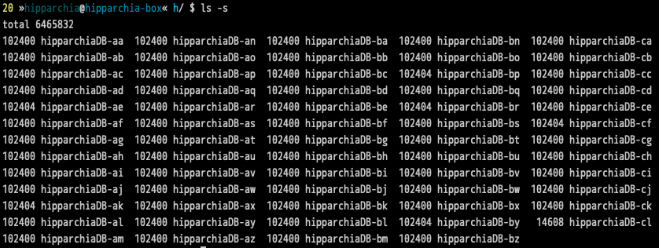

# Overview

- installing `HipparchiaGoServer` 
- running `HipparchiaGoServer`
- interacting with `HipparchiaGoServer`

## Installing HipparchiaGoServer

- first install and configure `PostgreSQL`
- next load `hipparchiaDB` into `PostgreSQL`
- next acquire a binary for `HipparchiaGoServer`

## Installing and configuring PostgreSQL 

- various platforms have various installation options; see [HERE](https://www.postgresql.org/download/)
  - on a mac `homebrew` is probably the best way: [https://docs.brew.sh/Installation](https://docs.brew.sh/Installation) 
  - you will be installing `Xcode` from apple first; then you can get `homebrew`; then you can ask for `postgresql`
    - so open `Terminal.app`: then, `xcode-select --install` (say "yes" to all the stuff you have to agree to; it might take a while for this to download and install)
    - then: `/bin/bash -c "$(curl -fsSL https://raw.githubusercontent.com/Homebrew/install/master/install.sh)"` (will require your admin password)
    - then one of the following:
        - `/opt/homebrew/bin/brew install postgresql` (M1 macs)
        - `/usr/local/bin/brew install postgresql` (intel macs)
    - then `brew services restart postgresql`
- after installing `PostgreSQL`
  - from the command line of a terminal execute `psql postgres` (or `sudo -u postgres psql postgres` if you do not have permission to do the first). NB: `Postgres.app` on macOS will install `psql` somewhere where you can't just type `psql postgres` to get into the database...
  - pick a password for `hippa_wr` then send the next two commands from the postgres shell: (all punctuation matters...)
      - `CREATE USER hippa_wr WITH PASSWORD 'some_random_password';`
      - `CREATE DATABASE "hipparchiaDB";`
  - exit postgresql by telling it `\q`


## loading hipparchiaDB into PostgreSQL

find the folder with the archive
open a terminal at that location (you can drag the folder onto `Terminal.app` or `cd` to it)
then:
```
cat /hipparchiaDB-* | psql "hipparchiaDB" --user hippa_wr
```
the password for `hippa_wr` will be requested when archiving/loading

FYI to archive:
```
pg_dump --clean "hipparchiaDB" --user hippa_wr | split -b 100m - out/hipparchiaDB-
```

an uncompressed archive is c. `3.6GB`



## Acquiring and running HipparchiaGoServer

- a binary can either be downloaded or built
  - builders will need to clone the source code in this archive and then compile it
- `HipparchiaGoServer` will run if you double-click it; or it can be launched from a terminal
- on first run it will complain that you do not have a `configuration` file: `hgs-conf.json`
  - this file tells `HipparchiaGoServer` the password for `hippa_wr`
  - Follow the template to create the configuration
  - the file name has to be correct; the file location correct; and the layout of the file correct
  


## Interacting with HipparchiaGoServer

- point a browser to [http://localhost:8000](http://localhost:8000)
- "hover" your cursor over interface items to get quick descriptions of their functions
- click on the `?` icon at the bottom right corner of the page for help
  - learn how to build search lists
  - learn how to compose simple and complex queries for words, phrases, and/or lemmatized words
- the little `gear icon` at the top right corner will let you adjust settings