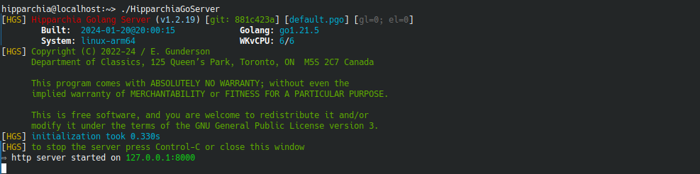

# Overview

- installing `HipparchiaGoServer` 
- running `HipparchiaGoServer`
- interacting with `HipparchiaGoServer`

## Installing HipparchiaGoServer

1. first install and configure `PostgreSQL`
1. next load `hipparchiaDB` into `PostgreSQL`
1. next acquire a binary for `HipparchiaGoServer`

### 1. Installing and configuring PostgreSQL 

- various platforms have various installation options
  - mac: look **below** for one of the two chief options; come back here when done
  - linux/bsd: some equivalent of `pkg install postgresql postgresql-contrib` is all that is needed; make sure start at system launch is configured
  - pc: you have only one option; jump through all the hoops; be careful to distinguish between the `postgres` password and the `hippa_wr` password (these are two users, one is the chief admin user); see also the note below about making an alias for the command
  - see [https://www.postgresql.org/download/](https://www.postgresql.org/download/) for more details and options
 - after installing `PostgreSQL`
   - from the command line of a terminal execute `psql postgres` (or `sudo -u postgres psql postgres` if you do not have permission to do the first). NB: `Postgres.app` on macOS will install `psql` somewhere where you can't just type `psql postgres` to get into the database...
   - pick a password for `hippa_wr` then send the following commands from the postgres shell: (all punctuation matters...)
       - `CREATE USER hippa_wr WITH PASSWORD 'some_random_password';`
       - `CREATE DATABASE "hipparchiaDB";`
       - `ALTER DATABASE "hipparchiaDB" OWNER TO hippa_wr;`
       - `CREATE EXTENSION pg_trgm;`
   - exit postgresql by telling it `\q`


### 2. loading hipparchiaDB into PostgreSQL

find the folder with the archive
open a terminal at that location (you can drag the folder onto `Terminal.app` or `cd` to it)
then, assuming the archive is inside a folder named `hDB`:
```
[if this is a fresh installation]
pg_restore -v -h localhost --clean --create --format=directory --username=hippa_wr --dbname=hipparchiaDB ./hDB

[if you are restoring]
pg_restore -v -h localhost --clean --format=directory --username=hippa_wr --dbname=hipparchiaDB ./hDB

[if either of those is failing try...]
pg_restore -v --format=directory --username=hippa_wr --dbname=hipparchiaDB ./hDB

```
the password for `hippa_wr` will be requested when archiving/loading

FYI to archive into a folder named `hDB`:
```
pg_dump -v -h localhost --clean --create --format=directory --file=hDB --username=hippa_wr hipparchiaDB
```

an uncompressed archive is c. `3.6GB`. A compressed archive is c. `1.9GB`.

Dumping and restoring are both **slow**. 

### 3. Acquiring and running HipparchiaGoServer

- a binary can either be downloaded or built
  - builders will need to clone the source code in this archive and then compile it
- `HipparchiaGoServer` will run if you double-click it; or it can be launched from a terminal
- on first run it will complain that you do not have a `configuration` file: `hgs-conf.json`; 
you will be given prompts to build one. Enter the password for `hippa_wr` when told to do so.
  



## Interacting with HipparchiaGoServer

- point a browser to [http://localhost:8000](http://localhost:8000)
- "hover" your cursor over interface items to get quick descriptions of their functions
- click on the `?` icon at the bottom right corner of the page for help
  - learn how to build search lists
  - learn how to compose simple and complex queries for words, phrases, and/or lemmatized words
- the little `gear icon` at the top right corner will let you adjust settings

---
## additional notes

### [a1] mac PostgreSQL installation via homebrew (best option)

- on a mac `homebrew`: [https://docs.brew.sh/Installation](https://docs.brew.sh/Installation)
- you will be installing `Xcode` from apple first; then you can get `homebrew`; then you can ask for `postgresql`
    - so open `Terminal.app`: then, `xcode-select --install` (say "yes" to all the stuff you have to agree to; it might take a while for this to download and install)
    - then: `/bin/bash -c "$(curl -fsSL https://raw.githubusercontent.com/Homebrew/install/master/install.sh)"` (will require your admin password)
    - then one of the following:
        - `/opt/homebrew/bin/brew install postgresql` (M1 macs)
        - `/usr/local/bin/brew install postgresql` (intel macs)
    - then `brew services restart postgresql`
- you might have to `reboot` to get `postgresql` to in fact load: you might as well do it now...
- return to the instructions above

### [a2] mac PostgreSQL installation via postgressapp (slightly easier at first; after that noticeably worse)

- on a mac [https://postgresapp.com/](https://postgresapp.com/) is another possibility: download and install
- make sure to do **step 3**: `sudo mkdir -p /etc/paths.d &&
  echo /Applications/Postgres.app/Contents/Versions/latest/bin | sudo tee /etc/paths.d/postgresapp`
- then open a terminal and continue
- two caveats
  - it does not look like `postgress.app` will give you PSQL with trigram indices. Searching will be slower.
  - `postgress.app` will need to be started/stopped manually vs homebrew which will always launch the database on system start

### [a3] mac PostgreSQL installation via EDB (not recommended)

- this definitely works, but you will have problems executing the simple steps above
- basically, if you do this you need to be ready to figure out how to get your shell to find `pg_restore`: it will be available, but where...?
- this should not be **that** hard, but I do not have a box configured this way so I don't know the exact recipe

---

### [b] windows advice

you should alias `psql` and `pg_restore` in your shell:

`Set-Alias psql 'C:\Program Files\PostgreSQL\*\bin\psql.exe'`

`Set-Alias psql 'C:\Program Files\PostgreSQL\*\bin\pg_restore.exe'`

After this you can execute the command to load...

---

### [c] troubleshooting: mac postgresql fails to launch

An empty file created when postgresql launches. It says, effectively, "I am running". 
It is deleted when postgresql stops. 
A crash of your computer or other "irregular" exit from postgresql can leave that file behind. 
Then when postgresql tries to launch it sees the file and fails to launch because it thinks, 
"Another copy of postgresql is already running..." The messages you are given are **not** helpful
in letting you know that this is the problem.

If you delete this file with the `rm` command, then postgresql will launch on your next reboot.

The location varies:

Intel:

`rm /usr/local/var/postgresql@14/postmaster.pid`

M1:

`rm /opt/homebrew/var/postgresql@14/postmaster.pid`

NB: if you are running `postgresqlNN` and `NN` is not `14`, then substitute `NN` for `14` above.  

