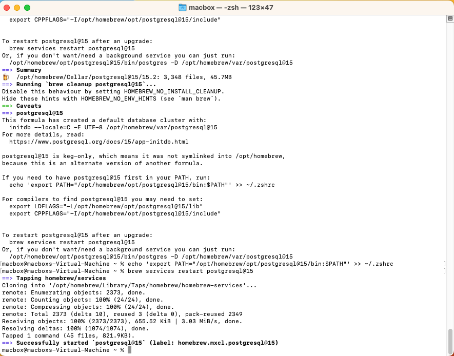

## Installing HipparchiaGoServer

1. first install and configure `PostgreSQL`
1. next load `hipparchiaDB` into `PostgreSQL`
1. next acquire a binary for `HipparchiaGoServer`

### [A] install and configure `PostgreSQL`

1. You will be working with `Terminal.app`. Launch it.

   

2. You will install `Homebrew` which will then install `PostgreSQL`. So go to https://brew.sh.

   

3. Copy the installation command on that page and paste it into the terminal.

   

4. Installation will take a while. You will need to hit `RETURN/ENTER` when prompted.
   
   

5. Installation will end, and you should do what it tells you as it ends and says: `Run these two commands...` Cut and paste them into the terminal.
 
   

   

6. `Homebrew` is now ready to go. Use it to install `PostgreSQL` by entering `brew search postgres`. Then ask to install the latest version, e.g., `brew install posgresql@15`

   

7. After installation, you will again be told to enter some set-up commands. Put `psql` in your `PATH` by cutting and pasting the command you will be provided: `echo 'export PATH="/opt/..."`
You also want to start the server: `brew services restart postgresql@15`

   

8. Now CLOSE the terminal window and open a NEW terminal window. Now enter `psql postgres`. This will log you into the database. And now you will enter a series of commands to set it up.

   - `CREATE USER hippa_wr WITH PASSWORD 'some_random_password';`
   - `CREATE DATABASE "hipparchiaDB";`
   - `ALTER DATABASE "hipparchiaDB" OWNER TO hippa_wr;`
   - `CREATE EXTENSION pg_trgm;`
   - `\q`
   
     
   
### [B] load `hipparchiaDB` into `PostgreSQL`

1. Open a new terminal window if you wish. Then `cd` to the directory that contains the
   data you will be loading. There is no need to `cd` if the data is in your home directory already. 

2. Enter `pg_restore -v --format=directory --username=hippa_wr --dbname=hipparchiaDB ./hDB` and watch as the data is loaded.

   

   

### [C] acquire `HipparchiaGoServer` and launch it

1. You can build `HipparchiaGoServer` yourself with the files in this repository. Or you can grab a pre-built binary. Download the correct binary. Intel Macs: `-darwin-amd64-` Apple Silicon: `-darwin-arm64-`

2. If you download a file like `HipparchiaGoServer-darwin-arm64-1.0.18.zip`, it needs to be UNZIPPED. Double-clicking will do that. You will then see something like `HipparchiaGoServer-darwin-arm64-1.0.18` in the same folder.

3. This file needs to be RENAMED: `HipparchiaGoServer-darwin-arm64-1.0.18` --> `HipparchiaGoServer`

   

   

4. Double-click to launch. It is possible that you will get a complaint about an UNIDENTIFIED DEVELOPER. In that case you need to go to `System Settings` -> `Gatekeeper` -> `Security` and then allow this application to run.

   

5. On the first run you will be asked for the password for `hippa_wr`.

   

6. Then you are running. You can point a browser at http://127.0.0.1:8000

   

7. Congratulations. All of this is one time only. From here on out you can just double-click the application like any other program.

--- 

### troubleshooting: if mac postgresql suddenly fails to launch

An empty file created when postgresql launches. It says, effectively, "I am running".
It is deleted when postgresql stops.
A crash of your computer or other "irregular" exit from postgresql can leave that file behind.
Then when postgresql tries to launch it sees the file and fails to launch because it thinks,
"Another copy of postgresql is already running..." The messages you are given are **not** helpful
in letting you know that this is the problem.

If you delete this file with the `rm` command, then postgresql will launch on your next reboot.

The location varies:

Intel:

`rm /usr/local/var/postgresql@15/postmaster.pid`

M1:

`rm /opt/homebrew/var/postgresql@15/postmaster.pid`

NB: if you are running `postgresqlNN` and `NN` is not `15`, then substitute `NN` for `15` above.