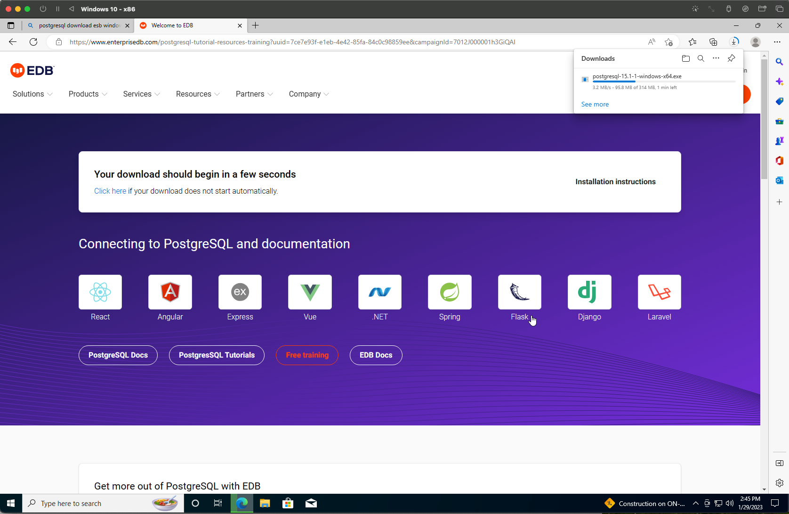
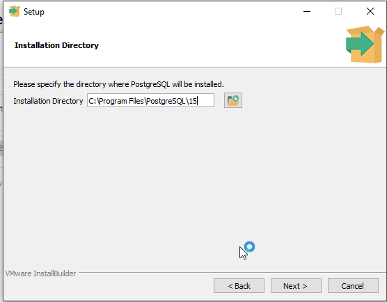
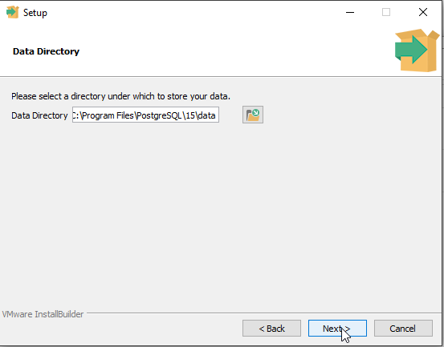
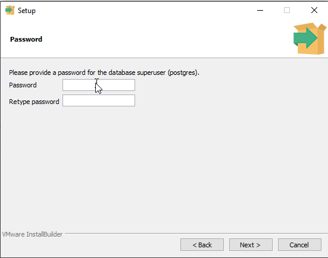
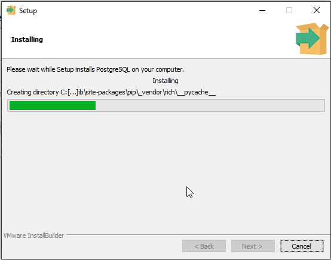
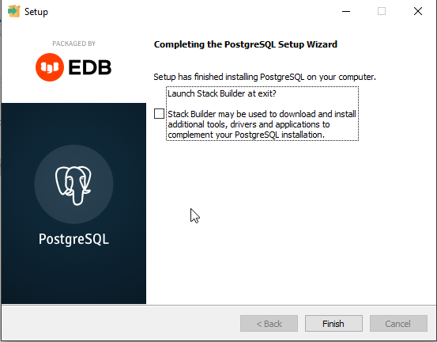
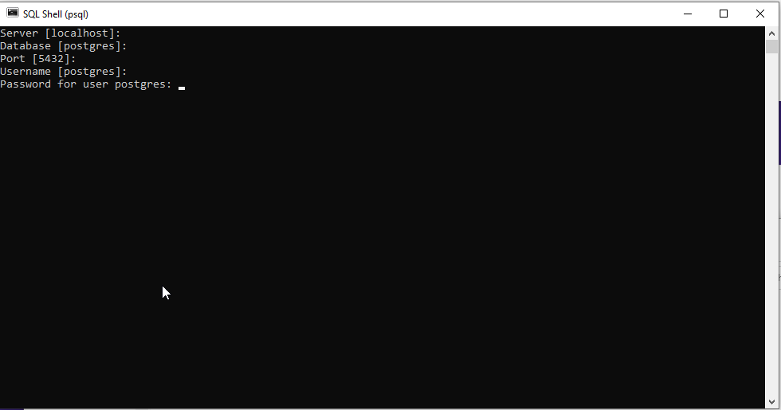
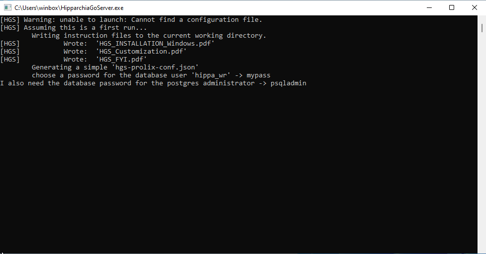

## Installing HipparchiaGoServer

1. first install and configure `PostgreSQL`
1. next load `hipparchiaDB` into `PostgreSQL`
1. next acquire a binary for `HipparchiaGoServer`

### [A] install and configure `PostgreSQL`
1. download from http://postgresql.org/downloads (which will send you to enterprisedb.com...)

2. launch the installer `postgresql-15.1-1-windows-x64.exe` (vel sim)

3. click through the installation options accepting *most* of the defaults...

4. stop mindlessly clicking 'Next >' and pick an ADMIN password; write it down somewhere; you will need to pick a different password later as a USER password

5. return to accepting defaults...

6. this one is big: you must pick `C` as your `locale`

7. back to just clicking forwards...

8. wait...

9. done. click "Finish". Do not launch Stack Builder

### [B] load `hipparchiaDB` into `PostgreSQL`
1. Launch `SQL Shell` which lives inside the `PostgreSQL 15` folder

2. Gain access to the `postgres` database by hitting `RETURN` 4x: you are accepting the default supplied values; 
at the fifth stop you will need to enter the ADMIN password you set earlier.

3. Now you will be creating a user (`hippa_wr`), creating a database (`hipparchiaDB`), giving the user 
permission to access the database, enabling fast indexing, and then quitting. You need to enter each line EXACTLY as
seen below but for the part where you enter a real password instead of `random_password`. All punctuation 
matters (a lot): quotation marks, semicolons, ...

4. Now you load the data into `PostgreSQL`. 
* First launch `PowerShell`. 
* Then `cd` to the directory that contains the 
data you will be loading. There is no need to `cd` if the data is in your home directory already. 
* Then set an alias to the `pg_restore.exe` application. You might need to change `15` in the example below to some
other number.
* Then execute `pg_restore`. The sample image has a typo. Make sure you enter `--username=hippa_wr`. 
You also need to set the name of the folder where the data lives properly. It might not be `hDB`.

### [C] acquire `HipparchiaGoServer.exe` and launch it
1. You can build `HipparchiaGoServer.exe` yourself with the files in this repository. Or you can grab a pre-built binary.

2. Double-click on the binary to launch. On the first launch you will be asked to enter the password for `hippa_wr`.

3. A configuration file will be generated and now you are running.

4. Now you can point a browser at http://127.0.0.1:8000
