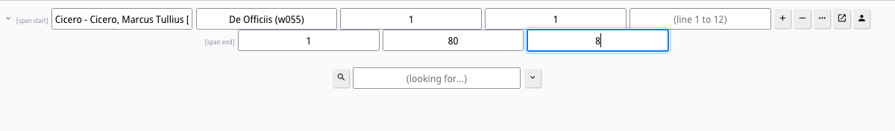

# HipparchiaGoServer - The basics
0. Built-in tips
1. Basic search area
2. Options panel
3. Building a search list by selecting a single author
4. Building a search list by selecting a single text / portion of a text
5. Building a search list with multiple texts and an exclusion
6. Selecting an arbitrary subsection of a work
7. Search for `All forms of...`
8. The different types of search
9. Saving/loading search lists
10. Browsing
11. Dictionary lookups in browsed passages
12. The dictionary is linked to the browser 
13. The dictionary is linked to a morphology chart maker. 
14. The morphology chart is linked to the searcher. 
15. The search results list is linked to the browser. 
16. Get a text of the current selection. 
17. Build and index of the current selection. 
18. Get the vocabulary for the current selection. 
19. Cancel a long search / vectorization request
20. I need to know still more...

---
[0] **Built-in tips**

If you hover the mouse over an element on the page, you should be shown a quick text tip. Note also that anything
that changes appearance if you hover over it can be clicked. A word will be looked up, for example.

---
[1] **Basic search area**

If you type something in the lower `(looking for...)` box and hit `RETURN` or click on the `Magnifying glass` icon, 
then the word or characters you typed will be searched for in the current selection. Since there is no specific 
selection at the moment, the current selection is `All Greek` and `All Latin`. See the side of the page: `Ⓖ` and `Ⓛ`.

The basic search area looks like:

---
[2] **Options panel**

You can change the `currently active corpora` and other settings by clicking on the `gear` icon in the upper left 
corner to open up the options panel. 

If you check/uncheck `Ⓛ` you will activate/deactivate the Latin corpus. The `Ⓛ` on the right side of the page will be
hidden when the Latin corpus is inactive. The other option items should be largely self-explanatory until you get 
to the `Neighbors` options. See the `SEMANTICVECTORS` instructions for more about that.

---

[3] **Building a search list by selecting a single author**

Make a selection by typing something in the `Authors (↑/↓)` box. This box has autocompletion. If you type `cic`, 
for example, you will be given the choice to pick between all known authors in the current active selections whose
names begin with `cic`. That would be `Cicero - Cicero, Marcus Tullius [lt0474]` and `Cicero, Quintus Tullius [lt0478]`.

If you select Marcus you will then see a box appear that invites you to `(Pick a work)`. At this point you can either 
continue on and select an individual work or just click on the `+` button to add Cicero to your search list.

Anything entered in `(looking for...)` at this point will initiate a search that looks inside of Cicero alone. 

**NB**: If you `double-click` an item on a search list, it will be removed from the search list. In this case you would
drop Cicero and revert to a full corpus search.

---

[4] **Building a search list by selecting a single text / portion of a text**

You can select individual works and portions of works by continuing on into the `(Pick a work)` box. This is also
an autocomplete form. So if you type `pro` you will see all the works of this author that contain the substring `pro`.

If you select one of these you will then see a new box appear that will show the range of items at the top level of the 
text from which you can choose. For the *Pro Marcello* the top level is going to be a `section` and the range is 
from 1 to 34. So you will see `(section 1 to 34)` appear in the new selection box. 

As this too is an autocomplete box, if you type `3` into it, you will see all the valid sections that contain `3`: 
3, 13, 23, 30, 31, ...

At any point you can click on the `+` button to add the current selection to your search list.

---
[5] **Building a search list with multiple texts and an exclusion**

To build a search list you can add multiple texts from multiple authors, genres, etc. You can also exclude items 
by clicking on the `-` button. To see extended search options click on the `...` button. This will make more 
autocomplete boxes available. Below you will see two example search lists: `Three works of Cicero, less one of the 
books of the De officiis` and `All of the Philosophici up to 200BCE less Aristotle and omit Plato's Republic`.

---
[6] **Selecting an arbitrary subsection of a work**

If you click on the tiny `right angle bracket` next to the left of the author box, you will enable `span selection`.
This will let you pick a section of a work that runs from A to B. You need to fill out the boxes for both A and B. But
this will let you pick `De officiis 1.1-1.80` or `De officiis 1-2` or `De officiis 1.50-3.15` or... 

---
[7] **Search for 'All forms of...'**

If you hover over the `down arrow` next to the `(looking for...)` box you will see that clicking on it will
allow you to `Complicate the search`. Do this, and you will reveal, among other things, the `λ` checkbox. When this
is clicked you will search not for `natura`, for example, but instead for `all known forms of 'natura'`. The word 
"known" in that phrase is a bit of a gotcha. Not every valid form of every word is correctly associated with its
headword. Nevertheless, if you want to search for every form of `officium` in Cicero's *De officiis*, click this box.
The complex search area lets you search for A near B. In the example below one is looking for all forms of A
near all forms of B in a subsection of a single work where A is `within N lines` of B.

---

[8] **The different types of search**

If you have clicked `Complicate the search`, then you now have access to the full collection of search types. 
* Single search box searches
  * An individual word or portion of a word: `antiq` or `antiquos` or `antiquu[sm]`, for example.
  * All forms of a word via the `λ` checkbox: `antiquus` (a word that has `45` known forms in use)
  * A phrase: `apud antiquos`
* Double search box searches
  * Two individual words `Caesar` near `Cicero`
  * All forms of X near some Y: all forms of `ago` near `bellis`, for example.
  * All forms of X near all forms of Y
  * A phrase near a single word or portion of a word: `non solum` near `agric`
  * A phrase near all forms of a word: `non solum` near all forms of `puer`
  * A phrase near another phrase: `non solum` near `sed etiam`

Use the scope constraints as needed: `near` vs `not near` and `within N lines` vs `within N words`

---
[9] **Saving/loading search lists**

If you look at the lower right side of the page you will see a disk icon and a folder icon. Click on either/both. 
Then you will see numbers: 1, 2, 3, 4, 5. If you click `Dark 1` you just saved the current settings, including the
current search list, to `Save Slot #1`. If you click `White 1` you will load the settings saved into that slot as
the new current settings. **NB:** Stored saves are wiped out when the server resets.

---
[10] **Browsing**

You can browse to any location in any text. Act as if you were about to add an author selection to a search list.
You can click on the `Expand` button at any time. 

If you have not picked a work, you will get the first line of the first work of that author. If you are currently 
looking at `Xenophon, Anabasis 2` in the selection box, then you will open a browser to the first line of the 
second book of that work. 

The browser arrow buttons will move you forward and back in the text. One will also close the browser. The arrow keys on your keyboard will also move the browser forward/back in the text.

---
[11] **Dictionary lookups in browsed passages**

The browser is linked to the dictionary.

You will notice that if you `hover` over any given word it will change color, gain a shadow, and have lines 
appear over/under it. If you click, then the server will attempt to parse this word and open up a dictionary entry
for it.

So if you click on `ἐβούλετο` at Xenophon, Anabasis 2.1.6.1 you will see the following appear on the left of the screen.

---
[12] **The dictionary is linked to the browser.**

If you click on the `blue` citations in the dictionary panel, the server will attempt to send you to that passage. So, the `βούλομαι` entry mentions `Herodotus 1.11`. If you hover over it, it will change color, gain a shadow, and have lines appear over/under it. If you click on this the browser will open Herodotus' Histories to that book and chapter.

---
[13] **The dictionary is linked to a morphology chart maker.**

If a dictionary entry says `417 known forms`, for example, you can click on that text and be sent to a chart of those 
forms. The numbers in parentheses show the count of occurrences of that form across all the data. 

---
[14] **The morphology chart is linked to the searcher.**

If you click on an item in a morphology chart, that word will be sought across the current search selction. So a click
on `ἑώραϲ (57)` returns a search that has 57 results (since all 57 items appear in `Ⓖ` which was currently active...)

---
[15] **The search results list is linked to the browser.** 

If you hover over the blue final segment of an item on a search result list citation it will change color, gain a 
shadow, and have lines appear over/under it. If you click on this the browser will open that author and work to that 
passage.

---

[16] Get a text of the current selection.

Click the icon and a text will be generated for whatever you have selected up to the `MaxText` configuration setting
(default: `35000` lines)

---

[17] Build and index of the current selection.

Click the icon and an index will be generated for whatever you have selected up to the `MaxText` configuration setting
(default: `35000` lines). If you click on a locus, a panel will open at that locus. 

---

[18] Get the vocabulary for the current selection.

Click the icon and a vocabulary list will be generated for whatever you have selected up to the `MaxText` configuration setting
(default: `35000` lines). If you click on a headword, a panel will open with the dictionary entry for that word. 

---

[19] Cancel a long search / vectorization request.

Click on the circled `X` in the upper left portion of the screen. This will reset your session and cancel
any searches in progress. Note that you will lose any search lists, etc. that are currently in use. 
Most useful to people who accidentally do an `everything` request on a slow machine and are in danger of jamming their CPU for several minutes. 

---

[20] **I need to know still more...**

More help is also available via the `?` button in the bottom right corner of the page. There you can learn about
`regex`, see some warnings about the data, etc. See also the separate instructions about `semantic vectors`. 

The latest help files should always be available at https://github.com/e-gun/HipparchiaGoServer/tree/stable/INSTRUCTIONS.