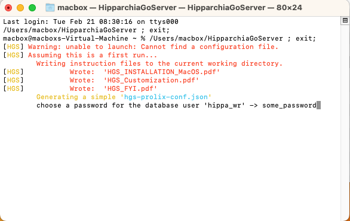
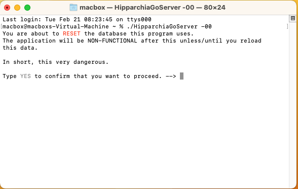

## Installing HipparchiaGoServer

1. first install and configure `PostgreSQL`
1. next load `hipparchiaDB` into `PostgreSQL`
1. next acquire a binary for `HipparchiaGoServer`

### [A] install and configure `PostgreSQL`

1. You will be working with `Terminal.app`. Launch it.

   

2. You will install `Homebrew` which will then install `PostgreSQL`. So go to https://brew.sh.

   

3. Copy the installation command on that page and paste it into the terminal.

   

4. Installation will take a while. You will need to hit `RETURN/ENTER` when prompted.
   
   

5. Installation will end, and you should do what it tells you as it ends and says: `Run these two commands...` Cut and paste them into the terminal.
 
   

   

6. `Homebrew` is now ready to go. Use it to install `PostgreSQL` by entering `brew search postgres`. Then ask to install the latest version, e.g., `brew install posgresql@15`

   

7. After installation, you will again be told to enter some set-up commands. Put `psql` in your `PATH` by cutting and pasting the command you will be provided: `echo 'export PATH="/opt/..."`
You also want to start the server: `brew services restart postgresql@15`

   

--- 

### [B] acquire `HipparchiaGoServer` and launch it

1. You can build `HipparchiaGoServer` yourself with the files in this repository. Or you can grab a pre-built binary. Download the correct binary. Intel Macs: `darwin-amd64` Apple Silicon: `darwin-arm64`

2. If you download a file like `HipparchiaGoServer-1.1.0-darwin-amd64.zip`, it needs to be UNZIPPED. Double-clicking will do that. You will then see something like `HipparchiaGoServer-1.1.0-darwin-amd64` in the same folder.

3. This file *might* need to be RENAMED: `HipparchiaGoServer-1.1.0-darwin-amd64` --> `HipparchiaGoServer`

### [C] the first launch of `HipparchiaGoServer`: loading `hipparchiaDB` into `PostgreSQL`

0. You need to have the DATA available. [The data needs to come from a `pg_dump` of a working `HipparchiaGoServer` installation. If a working installation executes `HipparchiaGoServer -ex`, it will generate a valid `hDB` folder.]
   The data needs to be in a folder named `hDB`. This folder should be in the same folder as `HipparchiaGoServer`.
   You can (re)move the data folder after you have successfully installed the data into the database.

1. Double-click to launch. It is possible that you will get a complaint about an UNIDENTIFIED DEVELOPER.
   In that case you need to go to `System Settings` -> `Gatekeeper` -> `Security` and then allow this application to run
   by clicking OPEN ANYWAY and then entering a password to confirm this.

2. The database load happens the first time you run `HipparchiaGoServer`. This will take *several minutes*.

3. On the first run instruction files will be dropped into your current working directory. You will be asked for the password for `hippa_wr`.

   

4. Then you will be told that the self-load is about to begin.

   

5. Thousands of messages will fly across the screen.

   

6. Eventually the server will launch. The self-load process only has to happen once.

   

NB: `hippa_rd` errors are safe to ignore.

7. When you see `http server started on 127.0.0.1:8000` you are up and running. From here on out you can just double-click
   to launch the program. You can also leave it running indefinitely: it does not consume many resources if not active.

### [D] [FYI] Archiving / Migrating

1. If you lose/destroy the `hDB` folder with the original data and want it back, the data can be extracted and archived.

2. Move `HipparchiaGoServer` into your home directory. Launch `Terminal.App`

3. Type `./HipparchiaGoServer -ex`. The data will be put into a new `hDB` folder in the current directory.

4. That folder will take up a lot of room on your machine. You could consider compressing it.

### [E] [FYI] Troubleshooting / Resetting

#### [E1] easier

1. Move `HipparchiaGoServer` into your home directory. Launch `Terminal.App`

2. Type `./HipparchiaGoServer -00`. If you say `YES`, the database will reset itself.

---

### troubleshooting: if mac postgresql suddenly fails to launch

An empty file created when postgresql launches. It says, effectively, "I am running".
It is deleted when postgresql stops.
A crash of your computer or other "irregular" exit from postgresql can leave that file behind.
Then when postgresql tries to launch it sees the file and fails to launch because it thinks,
"Another copy of postgresql is already running..." The messages you are given are **not** helpful
in letting you know that this is the problem.

If you delete this file with the `rm` command, then postgresql will launch on your next reboot.

The location varies:

Intel:

`rm /usr/local/var/postgresql@15/postmaster.pid`

M1:

`rm /opt/homebrew/var/postgresql@15/postmaster.pid`

NB: if you are running `postgresqlNN` and `NN` is not `15`, then substitute `NN` for `15` above.