## Installing HipparchiaGoServer

1. first install and configure `PostgreSQL`
1. next acquire a binary for `HipparchiaGoServer`
1. load `hipparchiaDB` into `PostgreSQL` on the first launch of `HipparchiaGoServer`
1. [fyi] how to archive and/or migrate the data
1. [fyi] how to reset the database and start over

---

### [A] install and configure `Postgres.app`

1. You will install `Postgres.app` which will then manage `PostgreSQL` for you. So go to https://postgresapp.com.

   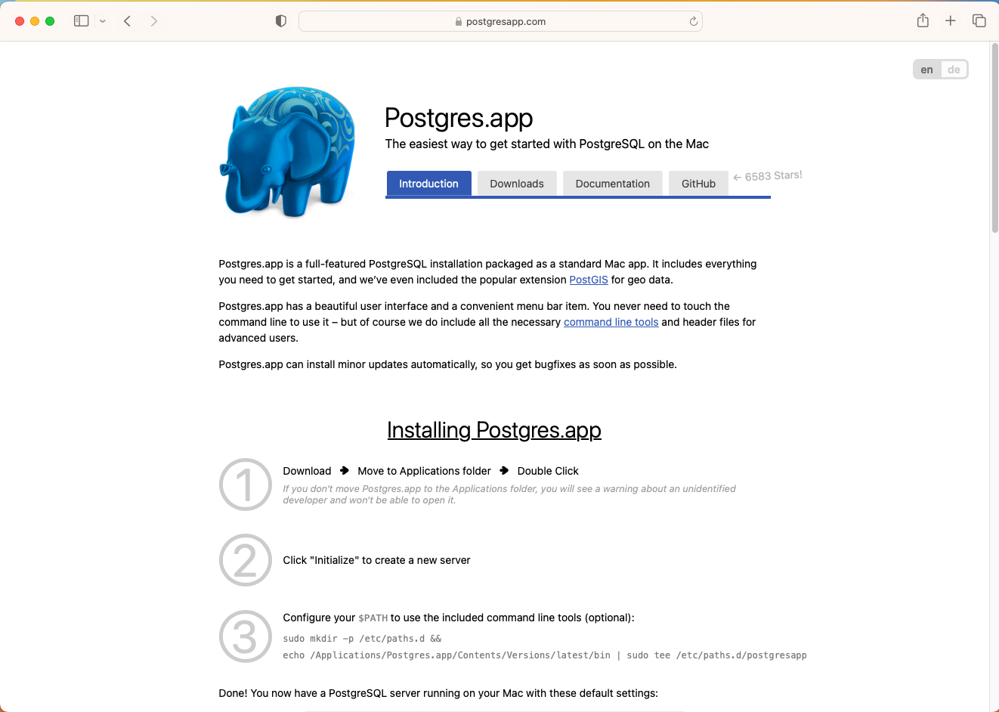
   
2. Download the application and drag it into your 'Applications' folder.

    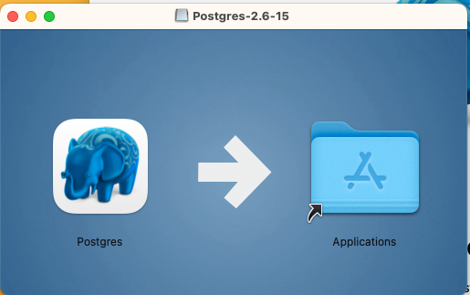

3. Launch the application. And then click `Initialize`.

    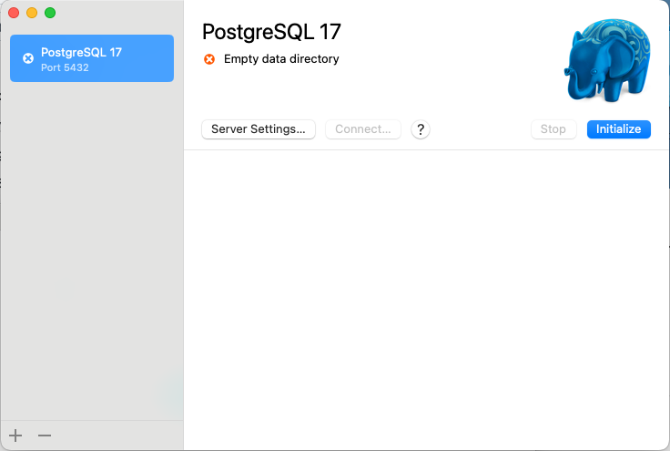

4. After you have initialized the server you might want to check that `PostgreSQL` is set to be constantly running. See `Server Settings...` and look for `Automatically start server`.

    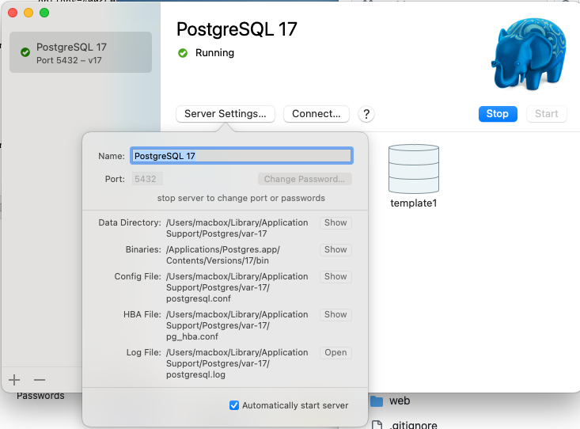

5. `Postgres.app` will add an item to your menu bar.

   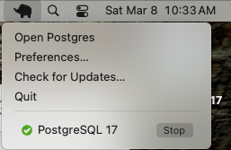

---

### [B] acquire `HipparchiaGoServer` and launch it

1. You can build `HipparchiaGoServer` yourself with the files in this repository (https://github.com/e-gun/HipparchiaGoServer). Or you can grab a pre-built binary from the site pictured below. Download the correct binary. Intel Macs: `darwin-amd64` Apple Silicon: `darwin-arm64`


2. If you download a file like `HipparchiaGoServer-1.1.0-darwin-amd64.zip`, it needs to be UNZIPPED. Double-clicking will do that. You will then see something like `HipparchiaGoServer-1.1.0-darwin-amd64` in the same folder.

3. This file *might* need to be RENAMED: `HipparchiaGoServer-1.1.0-darwin-amd64` --> `HipparchiaGoServer`

---

### [C] the first launch of `HipparchiaGoServer`: loading `hipparchiaDB` into `PostgreSQL`

0. You need to have the DATA available. [The data needs to come from a `pg_dump` of a working `HipparchiaGoServer` installation. If a working installation executes `HipparchiaGoServer -ex`, it will generate a valid `hDB` folder.]
   The data *must* reside in a folder named `hDB`. This folder has to be in the same folder as `HipparchiaGoServer`. Note that `hdb` ≠ `hDB`.
   You can (re)move the data folder after you have successfully installed the data into the database.

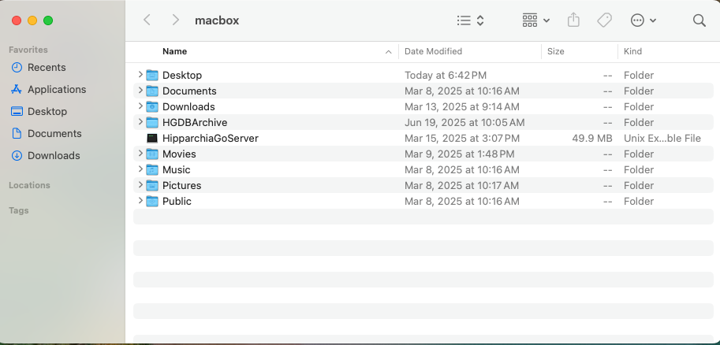

1. macOS has been locking down access to `unsigned` applications from `unknown developers`. This is a good thing in general, but not in this case. You need to force the system to trust the application. This can only be done via `Terminal.app`. So here we go... Launch `Terminal.app` (which can be found in `/Applications/Utilities`)

2. Double-check that `HipparchiaGoServer` is in your `Home` directory (because this is the directory that `Terminal.app` will send you to by default). Frustratingly, the Finder does not always make it easy to access this directory. If in doubt, type the following into `Terminal.app` and hit `return`: 
```
open ~
```


 If `HipparchiaGoServer` is not in this directory (perhaps it is in `Downloads` instead...), then move it here. Also make sure that the `hDB` is here. (This really only matters for the first launch and ensuring that the command in the next step exectues properly. After the first launch the `hDB` folder can be deleted if you wish and the application can be moved elsewhere.)

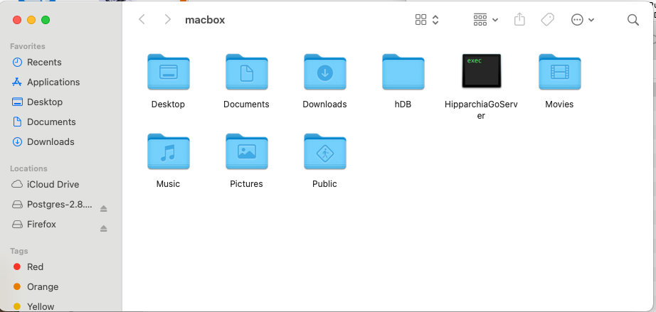

 
3. The following command will bypass the gatekeeper check on the application. Enter it in the terminal and press `return`: 
```
xattr -r -d com.apple.quarantine ./HipparchiaGoServer
```

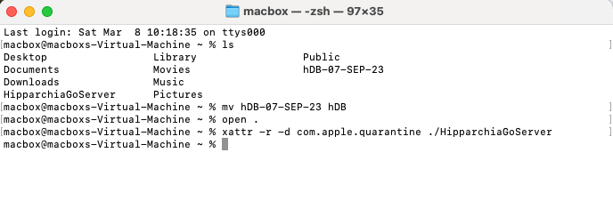

4. Now you can double-click the application to launch. It is possible that you will get a complaint about an UNIDENTIFIED DEVELOPER. This is a problem, and something went wrong in the previous step.

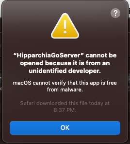

5. If you do not see that UNIDENTIFIED DEVELOPER warning, then congratulations. But at this point you will be told about a different potential security issue when you attempt to connect to `postgresql`. You need to `OK` this.

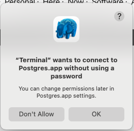


6. The database load happens the first time you run `HipparchiaGoServer`. This will take *several minutes*.

7. On the first run instruction files will be dropped into your current working directory. You will be asked for the password for `hippa_wr`.

   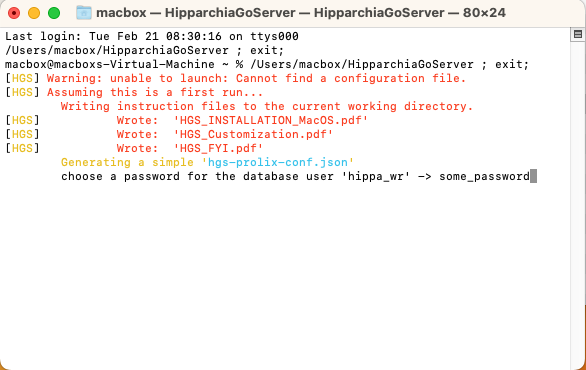

8. Then you will be told that the self-load is about to begin.

   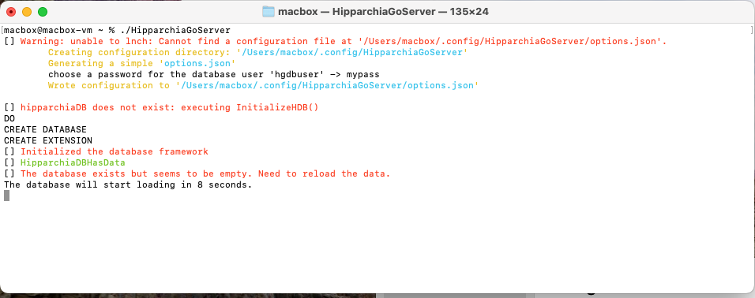

9. Thousands of messages will fly across the screen.

   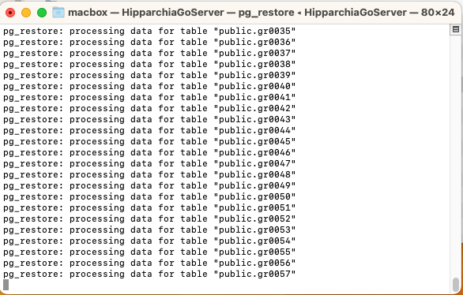

10. Eventually the server will launch. The self-load process only has to happen once.

   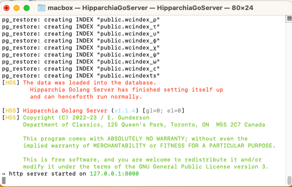

NB: `hippa_rd` errors are safe to ignore.

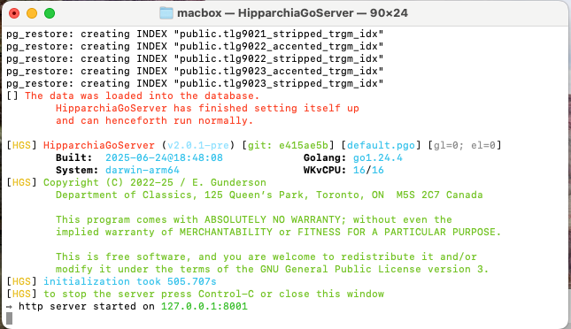

11. When you see `http server started on 127.0.0.1:8000` you are up and running. Now you can point a browser at http://127.0.0.1:8000.
Whenever the server is running, your browser can interact with http://127.0.0.1:8000. You can also leave the server 
running indefinitely. It does not consume many resources if not active: 0% CPU, <1% RAM.


---

### [D] [FYI] Archiving / Migrating

1. If you lose/destroy the `hDB` folder with the original data and want it back, the data can be extracted and archived.

2. Move `HipparchiaGoServer` into your home directory. Launch `Terminal.App`

3. Type `./HipparchiaGoServer -ex`. The data will be put into a new `hDB` folder in the current directory.

---

### [E] [FYI] Troubleshooting / Resetting

#### [E0] diagnostics 

Make sure to read all of the terminal output and scan for these tell-tale error messages.

##### [E0a] *You see*: `ERROR: relation "works" does not exist (SQLSTATE 42P01)`

*The problem is*: the database tables do not exist.

*The solution*: (1) `reset` + (2) `run`; after a `reset` [see `E1` below] the next launch is a `first launch` [see `C` above and note that you have to meet the requirements there for this second step to succeed]

##### [E0b] *You see*: `could not open input file "/Users/YOURUSER/hDB/toc.dat"`

*The problem is*: the `hDB` folder cannot be found.

*The solution*: make sure that the `hDB` folder is in the same folder as `HipparchiaGoServer`. [see `C0` above]

#### [E1] easier reset

1. Move `HipparchiaGoServer` into your home directory. Launch `Terminal.App`

2. Type `./HipparchiaGoServer -00`. If you say `YES`, the database will reset itself.

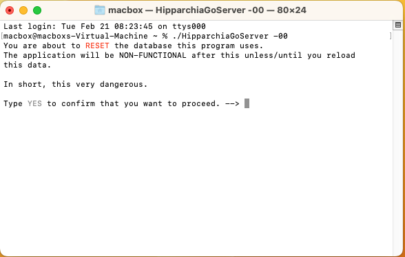

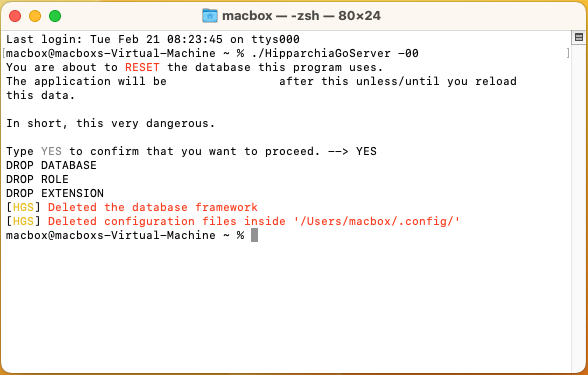

3. The next time you run `HipparchiaGoServer` will be like a first launch as per the above.


#### [E2] less easy reset

1. You will be working with `Terminal.app`. Launch it.

   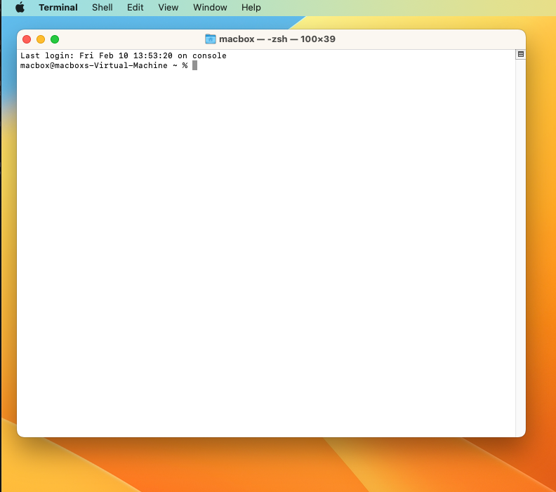

2. If you want to zap everything and start over, then open `Terminal.app` and enter the following:
- `rm ~/.config/hgs-*.json`
- `/Applications/Postgres.app/Contents/Versions/15/bin/psql postgres` [note that `15` might change at some date]
- - inside of `psql` enter the following
- - `DROP DATABASE "hipparchiaDB";`
- - `DROP USER hippa_wr;`
- - `DROP EXTENSION pg_trgm;`
- - `\q`

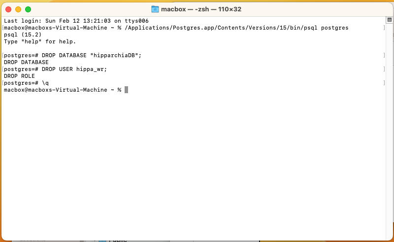


3. The next time you run `HipparchiaGoServer` will be like a first launch as per the above.
