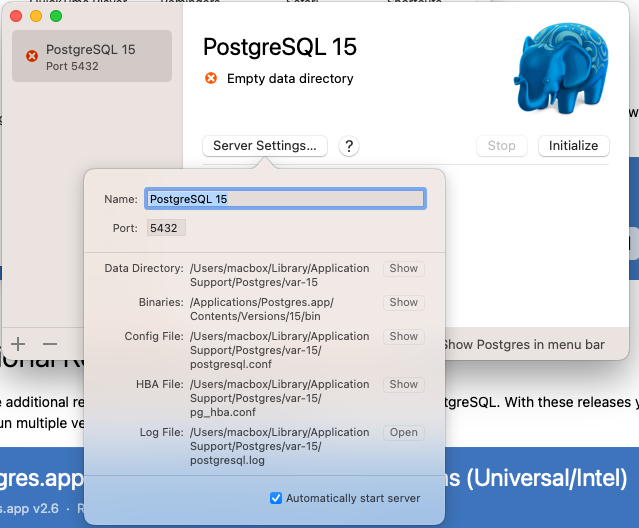
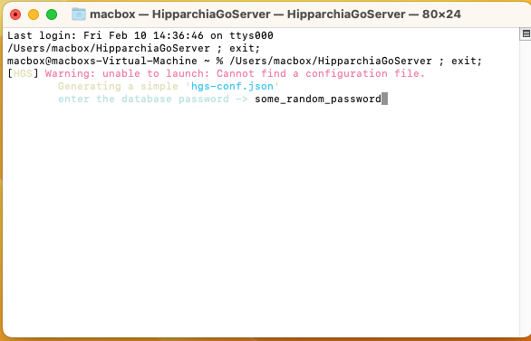

## Installing HipparchiaGoServer

1. first install and configure `PostgreSQL`
1. next acquire a binary for `HipparchiaGoServer`
1. load `hipparchiaDB` into `PostgreSQL` on the first launch of `HipparchiaGoServer`

### [A] install and configure `Postgres.app`

1. You will install `Postgres.app` which will then manage `PostgreSQL` for you. So go to https://postgresapp.com.

   
   
2. Download the application and drag it into your 'Applications' folder.

    

3. Launch the application. And then click `Initialize`.

    

4. After you have initizlized the server you might want to check that `PostgreSQL` is set to be constantly running. See `Server Settings...` and look for `Automatically start server`.

    

### [B] acquire `HipparchiaGoServer` and launch it

1. You can build `HipparchiaGoServer` yourself with the files in this repository. Or you can grab a pre-built binary. Download the correct binary. Intel Macs: `darwin-amd64` Apple Silicon: `darwin-arm64`

2. If you download a file like `HipparchiaGoServer-1.1.0-darwin-amd64.zip`, it needs to be UNZIPPED. Double-clicking will do that. You will then see something like `HipparchiaGoServer-1.1.0-darwin-amd64` in the same folder.

3. This file needs to be RENAMED: `HipparchiaGoServer-1.1.0-darwin-amd64` --> `HipparchiaGoServer`

   

   

4. Double-click to launch. It is possible that you will get a complaint about an UNIDENTIFIED DEVELOPER. In that case you need to go to `System Settings` -> `Gatekeeper` -> `Security` and then allow this application to run.

   

### [C] the first launch of `HipparchiaGoServer`: loading `hipparchiaDB` into `PostgreSQL`

0. You need to have the DATA available. [The data needs to come from a `pg_dump` of a working `HipparchiaGoServer` installation.]
   The data needs to be in a folder named `hDB`. This folder should be in the same folder as `HipparchiaGoServer`.
   You can (re)move the data folder after you have successfully installed the data into the database.

1. The database load happens the first time you run `HipparchiaGoServer`. This will take *several minutes*.

2. On the first run you will be asked for the password for `hippa_wr`.

   

3. Then you will be told that the self-load is about to begin.

   

4. After several minutes the server will launch. The self-load process only has to happen once.

   

### [D] Troubleshooting / Resetting

#### [D1] easier

1. Move `HipparchiaGoServer` into your home directory. Launch `Terminal.App`

2. Type `./HipparchiaGoServer -00`. If you say `YES`, the database will reset itself.

#### [D2] less easy

1. You will be working with `Terminal.app`. Launch it.

   

2. If you want to zap everything and start over, then open `Terminal.app` and enter the following:
- `rm ~/.config/hgs-conf.json`
- `/Applications/Postgres.app/Contents/Versions/15/bin/psql postgres` [note that `15` might change at some date]
- - inside of `psql` enter the following
- - `DROP DATABASE "hipparchiaDB";`
- - `DROP USER hippa_wr;`
- - `DROP EXTENSION pg_trgm;`
- - `\q`

3. The next time you run `HipparchiaGoServer` will be like a first launch as per the above.

### [E] Archiving

1. If you lose/destroy the `hDB` folder with the original data and want it back, the data can be extracted and archived.

2. Move `HipparchiaGoServer` into your home directory. Launch `Terminal.App`

3. Type `./HipparchiaGoServer -ex`. The data will be put into a new `hDB` folder in the current directory.

4. That folder take up a lot of room on your machine. You could consider compressing it.