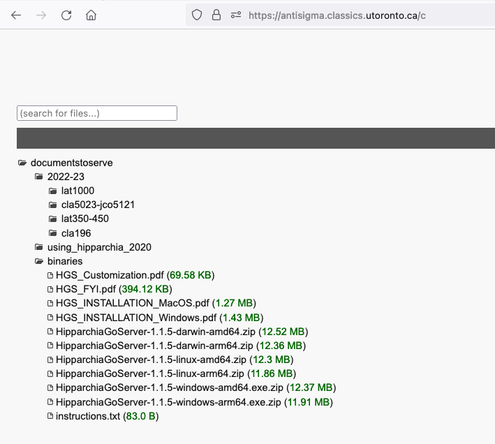

## Installing HipparchiaGoServer

1. first install and configure `PostgreSQL`
1. next acquire a binary for `HipparchiaGoServer`
1. launch `HipparchiaGoServer`

### [A] install and configure `PostgreSQL`

1. your platform will determine how to do this. Check http://postgresql.org/download for instructions


* If you `Copy, paste and run` as per their instructions, you will do the four things required to move forward:
  - install the server software
  - initialize the database
  - enable server launch at system startup
  - start the server
2. You should also install `postgresql-contrib` to get access to `pg_trgm`
  - to achieve this you will need to do something like `sudo dnf install postgresql15-contrib` or `sudo apt install postgresql-contrib`
3. Enter the `psql` shell: `sudo -u postgres psql` [alternate: `sudo su postgres` then `psql postgres`]
   - execute the following; use good/strong passwords and write them down:
```
ALTER USER postgres WITH PASSWORD 'somespqladminpass';
CREATE ROLE hippa_wr LOGIN ENCRYPTED PASSWORD 'somepassword' NOSUPERUSER INHERIT 
    CREATEDB NOCREATEROLE NOREPLICATION;
CREATE DATABASE "hipparchiaDB" WITH OWNER = hippa_wr ENCODING = 'UTF8';
CREATE EXTENSION pg_trgm;
\q
```
4. Depending on your platform, you **might** need to tinker with your postgres configuration. Find `pg_hba.conf`. It will be somewhere like `/var/lib/pgsql/15/data/pg_hba.conf` or `/etc/postgresql/14/main/pg_hba.conf`. [it can be found via executing `SHOW hba_file;` inside the `psql` shell]
   - Ensure that the `METHOD` in `pg_hba.conf` is `password` and NOT `peer` for `local` connections. 
   - Look at the end of the file and confirm that you see a block that looks like this:

```
 # TYPE  DATABASE        USER            ADDRESS                 METHOD  
 # "local" is for Unix domain socket connections only
 local   all             all                                     password

```
5. IF you do not see that block, edit `pg_hba.conf`. 
   - After the edit, you need to and reload the server: `sudo systemctl restart postgresql-15`, vel sim.). 

---

### [B] acquire `HipparchiaGoServer` and launch it

1. You can build `HipparchiaGoServer` yourself with the files in this repository (https://github.com/e-gun/HipparchiaGoServer). Or you can grab a pre-built binary from the site pictured below. Download the correct binary. 



2. If you download a zipped file like, it needs to be unzipped: e.g.,  `unzip HipparchiaGoServer-1.1.5-linux-amd64.zip`


### [C] launch `HipparchiaGoServer`

0. You need to have the DATA available. [The data needs to come from a `pg_dump` of a working `HipparchiaGoServer` installation. If a working installation executes `HipparchiaGoServer -ex`, it will generate a valid `hDB` folder.]
   The data needs to be in a folder named `hDB`. This folder has to be in the same folder as `HipparchiaGoServer`.
   You can (re)move the data folder after you have successfully installed the data into the database.
1. Launch the binary: `./HipparchiaGoServer`. 
2. The database load happens the first time you run `HipparchiaGoServer`. This will take *several minutes*.
3. On the first run instruction files will be dropped into your current working directory. You will be asked for the passwords for `hippa_wr` and `postgres`.
   

4. Then you will be told that the self-load is about to begin.
5. Thousands of messages will fly across the screen.
6. Eventually the server will launch. The self-load process only has to happen once.
NB: `hippa_rd` errors are safe to ignore.
7. When you see `http server started on 127.0.0.1:8000` you are up and running. You might as well click and then bookmark the following: http://127.0.0.1:8000.
   From here on out you can just double-click to launch the program. When the server is running, your browser can interact with http://127.0.0.1:8000.
   You can also leave the server running indefinitely. It does not consume many resources if not active: 0% CPU, <1% RAM.

