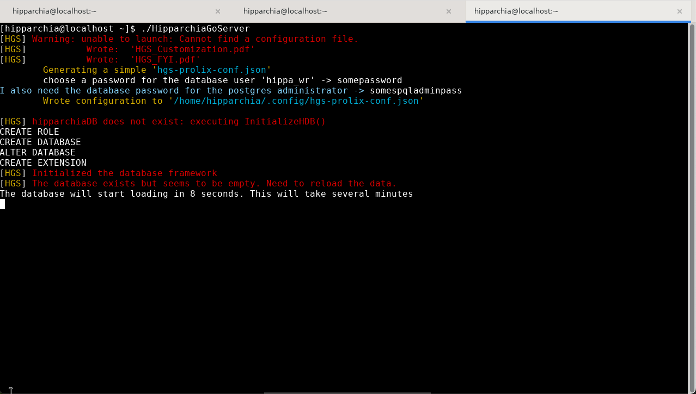

## Installing HipparchiaGoServer

1. first install and configure `PostgreSQL`
1. next acquire a binary for `HipparchiaGoServer`
1. launch `HipparchiaGoServer`

### [A] install and configure `PostgreSQL`

1. your platform will determine how to do this. Check `postgresql.org` for instructions


* If you `Copy, paste and run` as per their instructions, you will do the four things required to move forward:
  - install
  - initialize the database
  - enable launch at system startup
  - start the database
2. You should also install `postgresql-contrib` to get access to `pg_trgm`
  - to achieve this you will need to do something like `sudo dnf install postgresql-contrib`
3. Enter the `psql` shell: `sudo -u postgres psql`
   - execute the following; use good/strong passwords and write them down:
```
ALTER USER postgres WITH PASSWORD 'somespqladminpass';`
CREATE ROLE hippa_wr LOGIN ENCRYPTED PASSWORD 'somepassword' NOSUPERUSER INHERIT CREATEDB NOCREATEROLE NOREPLICATION;`
CREATE DATABASE "hipparchiaDB" WITH OWNER = hippa_wr ENCODING = 'UTF8';`
ALTER DATABASE "hipparchiaDB" OWNER TO hippa_wr;`
CREATE EXTENSION pg_trgm;`
\q
```
4. Find `pg_hba.conf`. It will be somewhere like `/var/lib/psql/15/data/pg_hba.conf`. 
   - Ensure that the `METHOD` in `pg_hba.conf` is `trust` and NOT `peer` for `local` connections. 
   - Look at the end of the file and confirm that you see a block that looks like this:

```
 # TYPE  DATABASE        USER            ADDRESS                 METHOD  
 # "local" is for Unix domain socket connections only
 local   all             all                                     trust

```
5. IF you do not see that block, edit `pg_hba.conf`. 
   - After the edit, you need to and reload the server: `sudo systemctl enable postgresql-15`, vel sim.). 

---

### [B] acquire `HipparchiaGoServer` and launch it

1. You can build `HipparchiaGoServer` yourself with the files in this repository. Or you can grab a pre-built binary. Download the correct binary. 


2. If you download a zipped file like, it needs to be unzipped: e.g.,  `unzip HipparchiaGoServer-1.1.5-linux-amd64.zip`


### [C] launch `HipparchiaGoServer`

1. Launch the binary: `./HipparchiaGoServer`. 
2. The database load happens the first time you run `HipparchiaGoServer`. This will take *several minutes*.
3. On the first run instruction files will be dropped into your current working directory. You will be asked for the passwords for `hippa_wr` and `postgres`.
   

4. Then you will be told that the self-load is about to begin.
5. Thousands of messages will fly across the screen.
6. Eventually the server will launch. The self-load process only has to happen once.
NB: `hippa_rd` errors are safe to ignore.
7. When you see `http server started on 127.0.0.1:8000` you are up and running. From here on out you can just double-click
   to launch the program. You can also leave it running indefinitely: it does not consume many resources if not active. 

