## Installing HipparchiaGoServer

1. first install and configure `PostgreSQL`
2. next acquire a binary for `HipparchiaGoServer`
3. then load `hgdb` into `PostgreSQL` when running `HipparchiaGoServer` for the first time
4. [fyi] how to archive and/or migrate the data
5. [fyi] how to reset the database and start over

---

### [A] install and configure `PostgreSQL`
1. download from http://postgresql.org/downloads (which will send you to enterprisedb.com...)

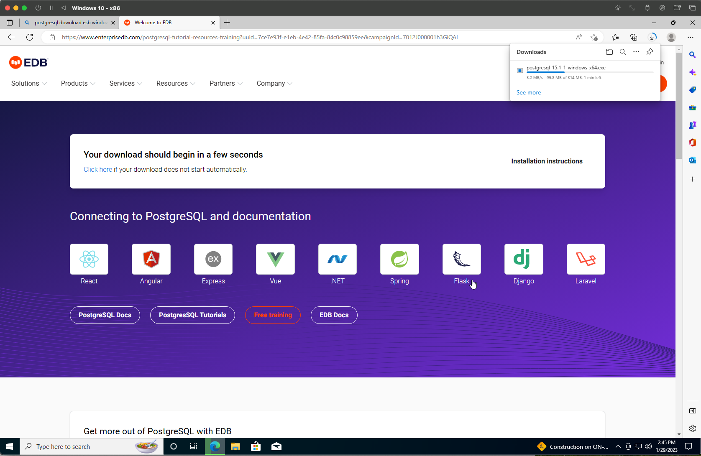

1. launch the installer `postgresql-15.1-1-windows-x64.exe` (vel sim)

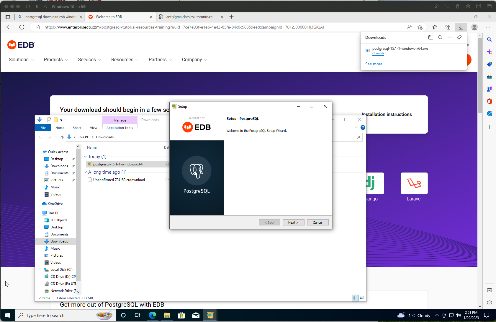

1. click through the installation options accepting *most* of the defaults...

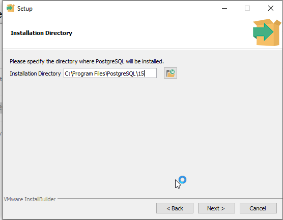

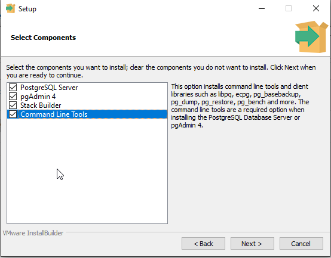

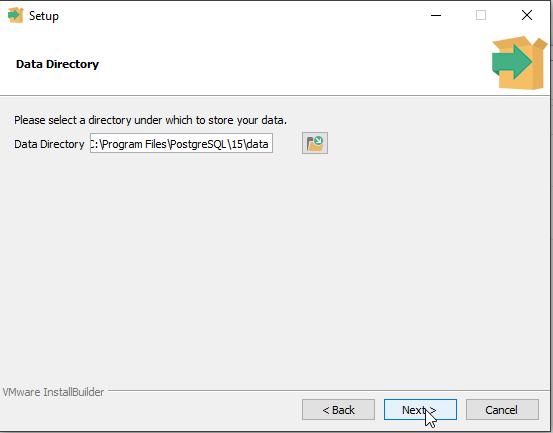

1. stop mindlessly clicking 'Next >' and pick an ADMIN password. Write it down somewhere. Do not lose it. 
You will need to pick a different password later as a USER password. You will need the ADMIN
password at `C.2` below. 

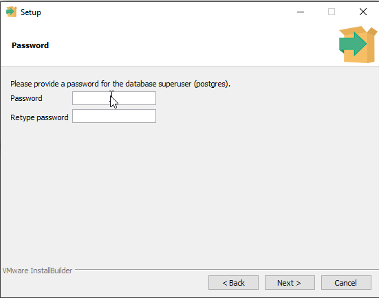

1. return to accepting defaults...
   (note that if you select a port other than `5432` the initial insertion of the data will become very tricky since the installer will default to `5342` and you will need to install with various command line options set)

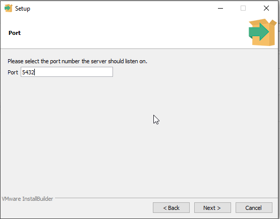

1. this one is *extremely important* and not a default value: you must pick `C` as your `locale`

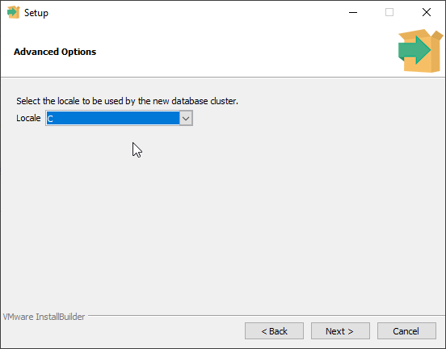

1. back to just clicking forwards...

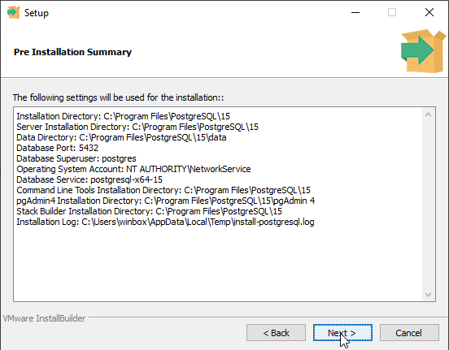

1. wait...

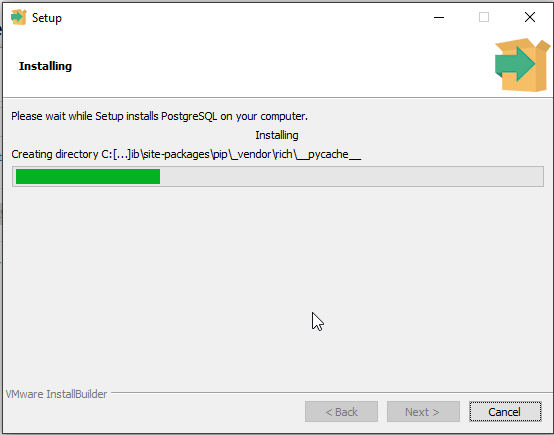

1. done. click "Finish". Do not launch Stack Builder

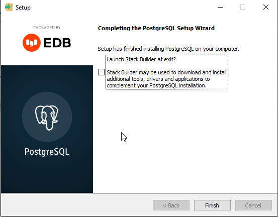

---

### [B] acquire `HipparchiaGoServer.exe` and launch it
1. You can build `HipparchiaGoServer.exe` yourself with the files in this repository (https://github.com/e-gun/HipparchiaGoServer). Or you can grab a pre-built binary from the site pictured below.

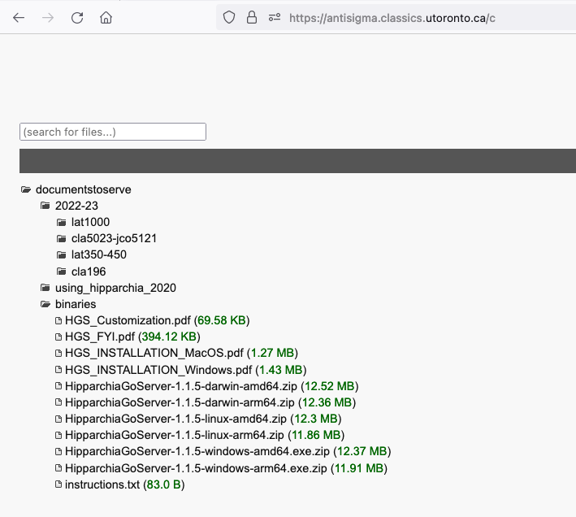

1. Double-click on the binary to launch. 

---

### [C] the first launch of `HipparchiaGoServer`: loading `hgdb` into `PostgreSQL`
1. You need to have the DATA available. [The data needs to come from a `pg_dump` of a working `HipparchiaGoServer` installation.]
   The data *must* reside in a folder named `HGDBArchive`. This folder has to be in the same folder as `HipparchiaGoServer`. 
See the image and note that both are present in the same directory. You can (re)move the data folder after you
have successfully installed the data into the database.

NB: The data will already be available if you build the database yourself with `HipparchiaGoBuilder`. And several of the steps below will be skipped. But building and running `HipparchiaGoBuilder` is beyond the scope of these instructions.
  
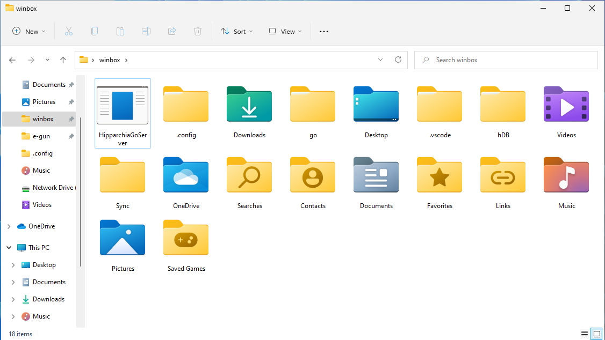

1. The first launch might cause `Microsoft Defender` to complain that the app is `unrecognized`. Click `More Info` and then `Run anyway`.

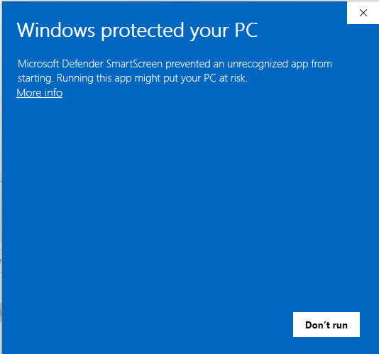

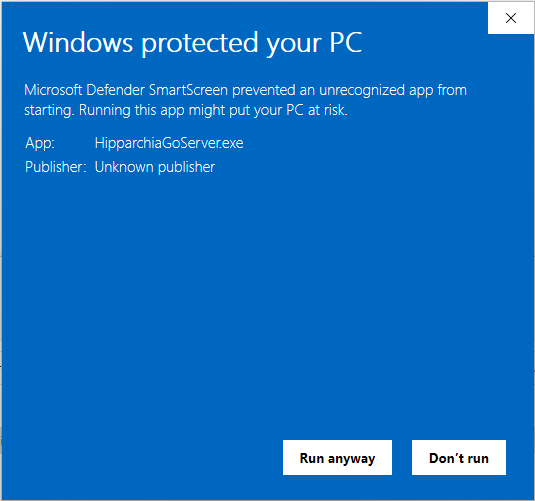

1. The database load happens the first time you run `HipparchiaGoServer`. This will take *several minutes*.

2. On the first run instruction files will be dropped into your current working directory. You will be asked for a fresh password for `hippa_wr` you will also need the 
PSQL administrator password you entered at `A.4` above.

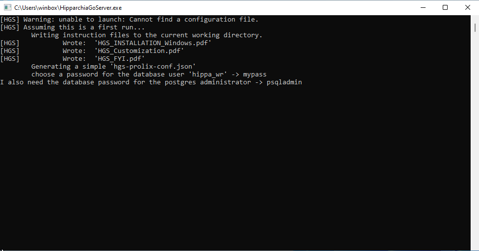

1. A configuration file will be generated and now `HipparchiaGoServer` will attempt to build and load its database.

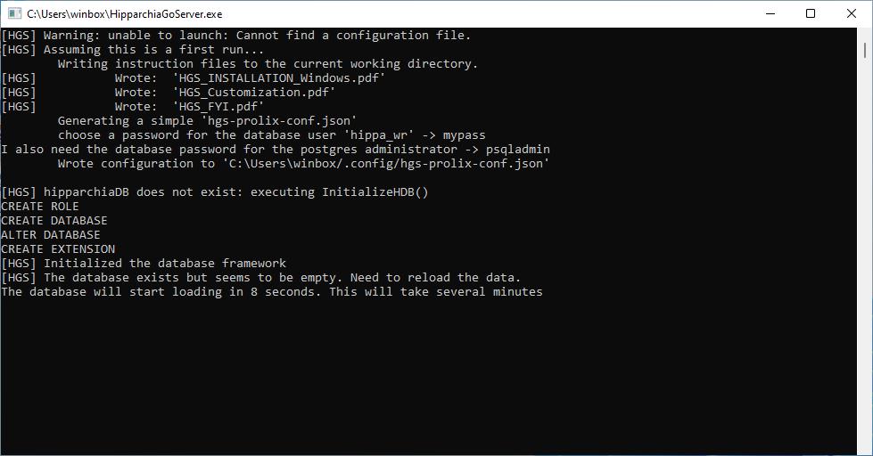

1. When loading you will see thousands of messages in the console.

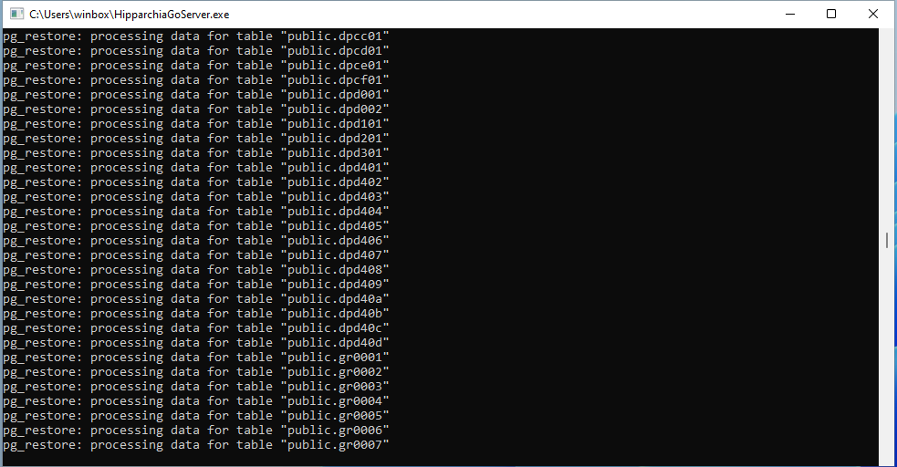

1. Now you can point a browser at http://127.0.0.1:8001. You can also leave the server running indefinitely. It does not consume many resources if not active: 0% CPU, <1% RAM.

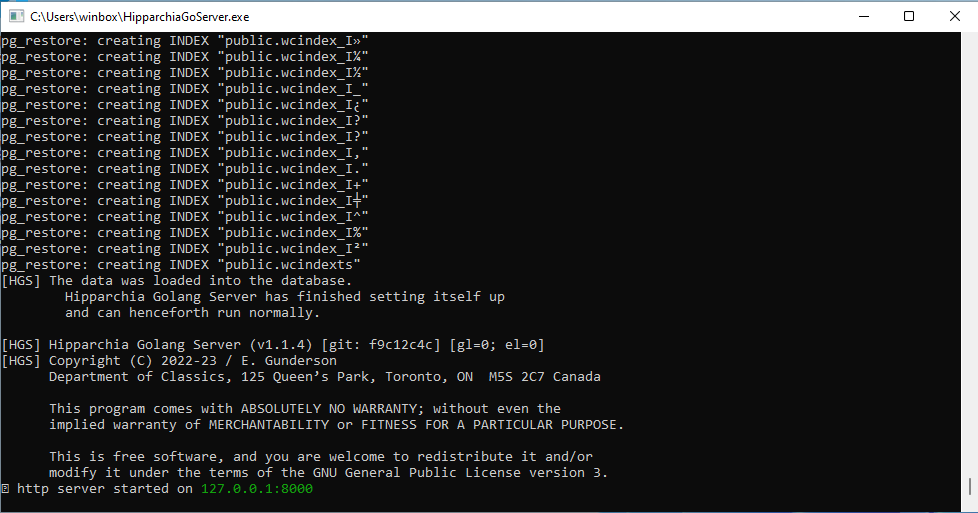

---

### [D] Archiving / Migrating

1. If you lose/destroy the `HGDBArchive` folder with the original data and want it back, the data can be extracted and archived.

2. Move `HipparchiaGoServer` into your home directory. Launch `PowerShell`

3. Type `.\HipparchiaGoServer.exe -ex`. The data will be put into a new `HGDBArchive` folder in the current directory.

---

### [E] Troubleshooting / Resetting

#### [E1] easier

1. Move `HipparchiaGoServer` into your home directory. Launch `PowerShell`

2. Type `.\HipparchiaGoServer.exe -00`. If you say `YES` and give the ADMIN password to `PostgreSQL`, the database will reset itself.

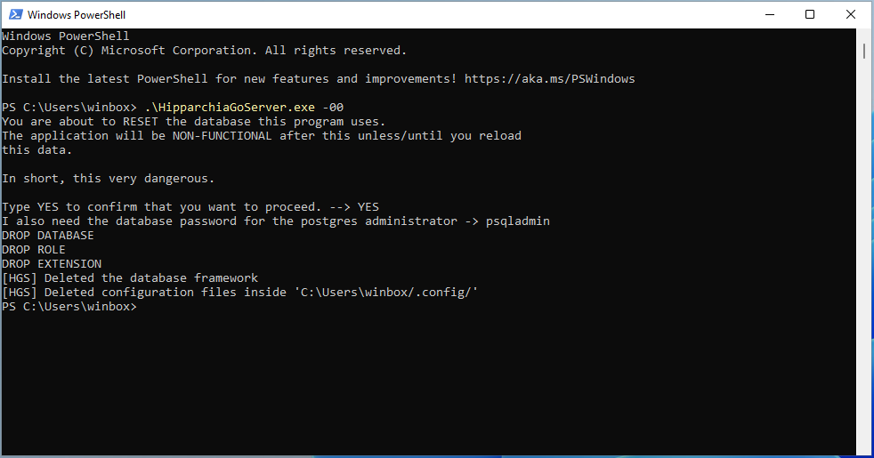

#### [E2] less easy

1. Delete the `HipparchiaGoServer` folder in the `.config` folder of your home folder.

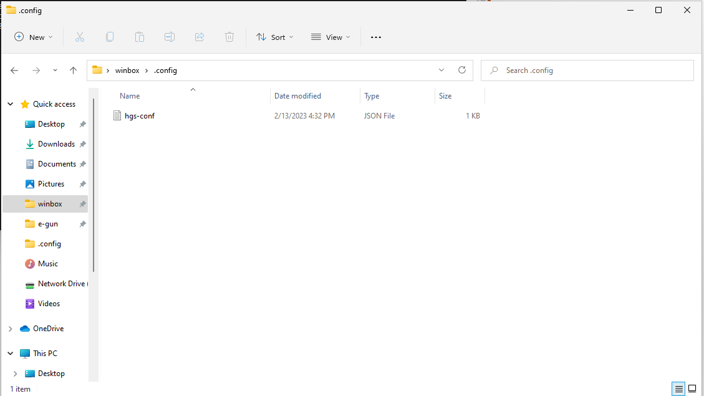

1. Launch `SQL Shell` (which can be found inside the `PostgreSQL 17` folder).

2. Gain access to the `postgres` database by hitting `RETURN` 4x: you are accepting the default supplied values;
      at the fifth stop you will need to enter the ADMIN password you set earlier in `A.4`.

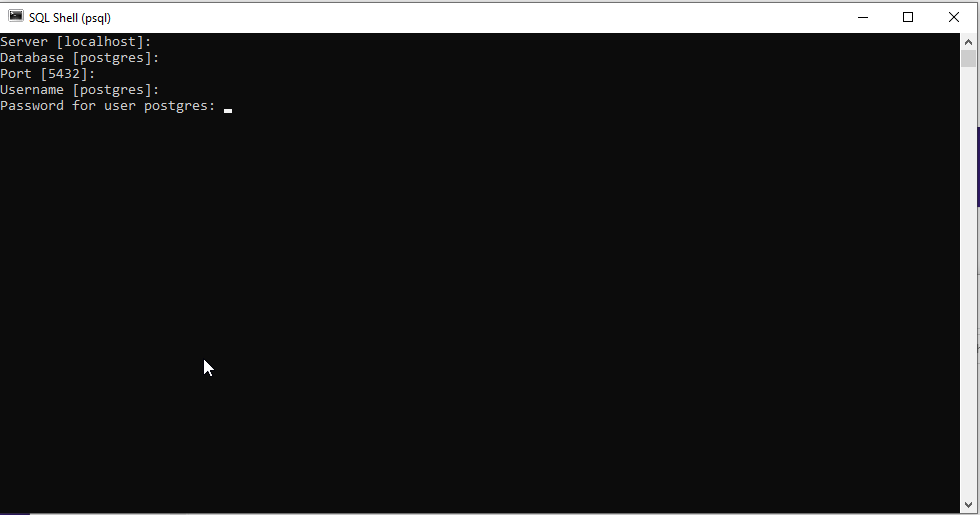

1. Now enter the following:
- `DROP DATABASE "hgdb";`
- `DROP USER hgdbuser;`
- `DROP EXTENSION pg_trgm;`
- `\q`

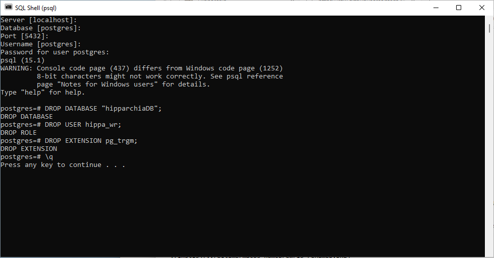

1. The next time you run `HipparchiaGoServer` will be like a first launch as per the above.
