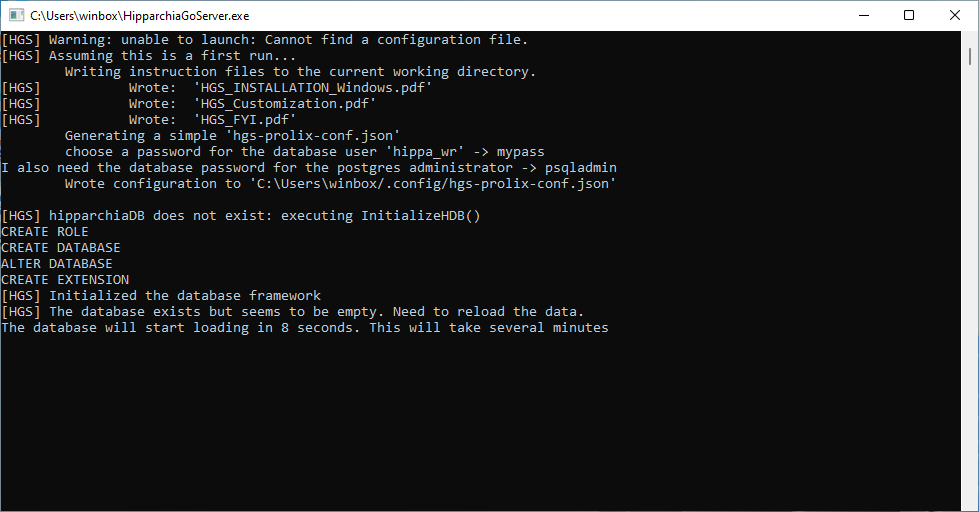
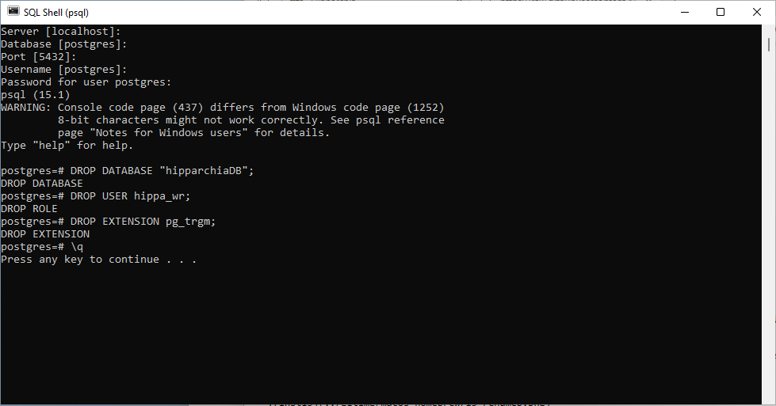

## Installing HipparchiaGoServer

1. first install and configure `PostgreSQL`
1. next load `hipparchiaDB` into `PostgreSQL`
1. next acquire a binary for `HipparchiaGoServer`

### [A] install and configure `PostgreSQL`
1. download from http://postgresql.org/downloads (which will send you to enterprisedb.com...)

2. launch the installer `postgresql-15.1-1-windows-x64.exe` (vel sim)

3. click through the installation options accepting *most* of the defaults...

4. stop mindlessly clicking 'Next >' and pick an ADMIN password. Write it down somewhere. Do not lose it. 
You will need to pick a different password later as a USER password. You will need the ADMIN
password at `C.2` below. 

5. return to accepting defaults...

6. this one is big: you must pick `C` as your `locale`

7. back to just clicking forwards...

8. wait...

9. done. click "Finish". Do not launch Stack Builder

### [B] acquire `HipparchiaGoServer.exe` and launch it
1. You can build `HipparchiaGoServer.exe` yourself with the files in this repository. Or you can grab a pre-built binary.

2. Double-click on the binary to launch. 

### [C] the first launch of `HipparchiaGoServer`: loading `hipparchiaDB` into `PostgreSQL`
0. You need to have the DATA available. [The data needs to come from a `pg_dump` of a working `HipparchiaGoServer` installation.]
The data needs to be in a folder named `hDB`. This folder should be in the same folder as `HipparchiaGoServer`.
See the image and note that both are present in the same directory. You can (re)move the data folder after you
have successfully installed the data into the database.
  

1. The database load happens the first time you run `HipparchiaGoServer`. This will take *several minutes*.

2. On the first run you will be asked for a fresh password for `hippa_wr` you will also need the 
PSQL administrator password you entered at `A.4` above.

3. A configuration file will be generated and now `HipparchiaGoServer` will attempt to build and load its database.

4. When loading you will see thousands of messages in the console.

4. Now you can point a browser at http://127.0.0.1:8000

### [D] Troubleshooting / Resetting

#### [D1] easier

1. Move `HipparchiaGoServer` into your home directory. Launch `PowerShell`

2. Type `.\HipparchiaGoServer.exe -00`. If you say `YES` and give the ADMIN password to `PostgreSQL`, the database will reset itself.

#### [D2] less easy

1. Delete `hgs-conf.json` in the `.config` folder of your home folder.

2. Launch `SQL Shell` (which can be found inside the `PostgreSQL 15` folder).

3. Gain access to the `postgres` database by hitting `RETURN` 4x: you are accepting the default supplied values;
      at the fifth stop you will need to enter the ADMIN password you set earlier in `A.4`.

4. Now enter the following:
- `DROP DATABASE "hipparchiaDB";`
- `DROP USER hippa_wr;`
- `DROP EXTENSION pg_trgm;`
- `\q`

5. The next time you run `HipparchiaGoServer` will be like a first launch as per the above.

### [E] Archiving

1. If you lose/destroy the `hDB` folder with the original data and want it back, the data can be extracted and archived.

2. Move `HipparchiaGoServer` into your home directory. Launch `PowerShell`

3. Type `.\HipparchiaGoServer.exe -ex`. The data will be put into a new `hDB` folder in the current directory.

4. That folder take up a lot of room on your machine. You could consider compressing it.