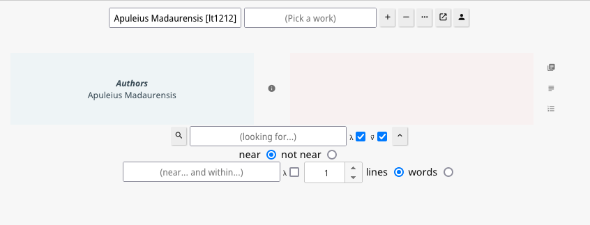
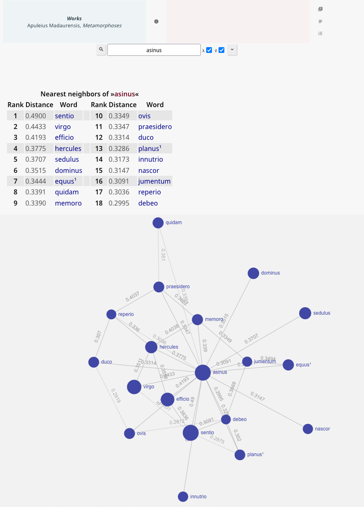
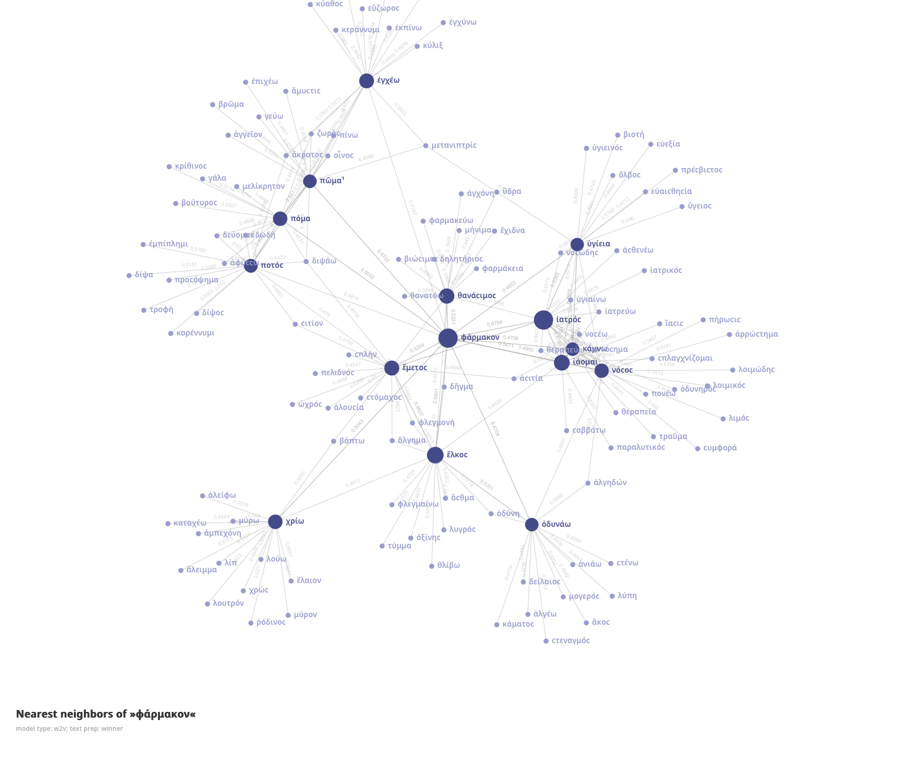
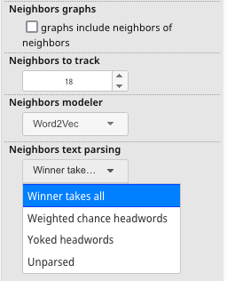

# Semantic Vector Nearest Neighbor Searches

## Building Models
If you request a lemmatized search (λ), you will be presented with the option to convert your search to a vectorized 
search (v⃗).



The server will check to see if there is a pre-built model for the current combination of options and texts selected.

If there is no model, one will be built and then saved for subsequent use. Building can be **slow**. Re-use is very fast. 

### Sample Simple Neighbors Output 



### Sample Neighbors of Neighbors Output



--- 

## Notes about model building

See also the sections on **Model Makers** and **Text Preparation** below.

Models of <100k lines are quick and easy enough to build. After that, modeling can become a chore.

This makes it important not to make a query unless you have a search list built. If the search list is empty, you just
requested "everything". And that might mean all of both Greek and Latin and perhaps the inscriptions...This click can
hog your machine for 60+ minutes unless `VectorMaxlines` is set to a low number.

Expect to wait a significant amount of time if you try to model the entire corpus of Latin, for example: c 900k lines.
This will take several minutes on a fast machine. All of Greek is even more formidable. Note that the default 1 million
line cap on models will prevent building a model of the whole Greek corpus. Edit `hgs-prolix-conf.json` to change
`VectorMaxlines` to 9 million lines. Preparing the text will take >11 minutes. This is before the model even starts
its training runs. Each training iteration will take >3m on a fast machine. Queries of this model take >15s: `205MB`
of data has to be fetched and decompressed.

But note that a model of Greek with "only" 1M lines instead of 9M lines still produces good and interesting associations.
People for whom 1M words are not enough could try 3M, or 6M, or... A lot of Greek is post 300CE, people who are not interested
in that material could shave millions of words of their models. Because of the way the bulk search algorithm executes
there will be a bias towards "classical" greek in line-limited grabs. Capped models are generally "earlier" models. 

```
(building all of greek)
[HGS] generateembeddings() gathered 8992999 lines
[HGS] arraytogetrequiredmorphobjects() will search among 218526522 words
[HGS] fetchheadwordcounts() will search for 630893 headwords
[HGS] vectordbadd(): 423bccb6be32a80a992176a548e8630a
[HGS] 423bccb6be32a80a992176a548e8630a compression: 745572k -> 210508k (28.2 percent)
[HGS] VectorSearch() runtime.GC() 4468M --> 1436M
(subsequent queries)
[HGS] VectorSearch() runtime.GC() 2029M --> 431M
```
Note as well that vectorization can be memory intensive. A query of the full Latin corpus needs to allocate c. `450MB` of
extra RAM: `[HGS] VectorSearch() runtime.GC() 694M --> 237M`. You might want to set `DocInMemory` to `false` if you
try to build all of Greek as `HGS` will use `30GB` of RAM while building. Few computers have that much memory. And if you
run out of memory a slow operation will become very, very slow if it finishes at all.

---

## Configuration options

There is currently no browser-facing interface that allows for the customization of the rules used to build these 
models. Instead users will need to manually edit configuration files. Nevertheless, most people will feel little to
no need to edit these files. The defaults are sensible. Only the very keen and very curious will change them.

Vector models have three relevant configuration files stored inside of `~/.config/`. These are:
* `hgs-vector-conf-w2v.json`
* `hgs-vector-conf-lexvec.json`
* `hgs-vector-conf-glove.json`
* `hgs-vector-stops-greek.json`
* `hgs-vector-stops-latin.json`

If these are not present, they will be regenerated with default values. So, if you wish to revert an aspect of your 
set-up to its initial condition, you only need to delete one or more of these files.  

There is no way to drop an individual model. But you can reset the collection of stored models if you launch the server
with the `-rv` flag: `HipparchiaGoServer -rv`

Any edit to any of these configuration files will be detected when you next search. A new model will be built with those 
new settings. There is no need to restart the server.

The `stops` are lists of terms you wish to omit from the model. These should be common words that reveal little about the
underlying collection of words: "the", "this", "a", "where", "so", "under" ... 

---

## Text Preparation



The pre-modeled text can be prepared in a variety of ways. Each has its trade-offs. 
* `Unparsed` will just model the raw text. But that means that `dedissent` and `dare` each get their own separate analysis. And so if you want to know how the verb works in general, you have only indirectly looked at that. 
* `Winner takes all` will look at every word and then try to parse it. For example, `est` might be from `edo` or `sum`. Forms of `sum` are more common. So we assign `est` to `sum` 100% of the time. The text is then rewritten as a collection of headwords rather than inflected forms. The model is built against this rewritten text. *This is the current default method for preparing texts*.
* `Weighted chance headwords` will look at every word and then try to parse it. For example, `apte` can be found under `apte` or `aptus` in the lookup tables. But inflected forms of `aptus` are about 10x more common than `apte` in the data. So every time `apte` is seen it will be assigned to `aptus` 90% of the time. The text is then rewritten as a collection of headwords rather than inflected forms. 
* `Yoked headwords` will look at every word and then try to parse it. For example, `est` might be from `edo` or `sum`. No choice will be made. Instead `edo•sum` will be inserted into the text. The text is then rewritten as a collection of yoked headwords.

With `Unparsed` you will have a lot of trouble tracking concepts. With `Winner takes all` many words will never appear, even common ones that really should appear. `Weighted chance headwords` is inserts a bunch of hidden guesses. `Yoked headwords` will model both `edo•sum` and `sum` AND you will need to search for `edo•sum` to see its neighbors, i.e., a form you were not likely to guess and request. But the modeler does an OK job of it in the end, especially given how imperfect the parsing data is. And unless/until ever word of every text is perfectly parsed, that will have to be good enough.

---

## Model Makers

### Word2Vec

This is the default model maker. 

The default model building values follow. The values that one is most likely to adjust are `BatchSize`, `Dim`, `Iter`, 
and `Window`.

* Bigger `BatchSize` values should build faster, but the results might be less interesting. 
* Dimensionality (`Dim`) sets how many interrelationships to track. Too few or too many yield poor results. The "right" value is likely an illusion, but good choices are related to the size of the corpus you are searching.
* Iterations (`Iter`) are "training runs" on the data. It is possible to over-train. It is possible to under-train. 
* The `Window` setting adjusts the distance across which relationships will be tracked. If A and B are outside the window, no association between them will be noted.

Tinkering with these four settings is not a bad idea. It would be a good idea to read up on `word2vec` before exploring
the other settings. 

The default `hgs-vector-conf-w2v.json`:

```
{
    "BatchSize": 1024,
    "Dim": 125,
    "DocInMemory": true,
    "Goroutines": [= runtime.NumCPU() on your machine],
    "Initlr": 0.025,
    "Iter": 15,
    "LogBatch": 100000,
    "MaxCount": -1,
    "MaxDepth": 150,
    "MinCount": 10,
    "MinLR": 0.0000025,
    "ModelType": "skipgram",
    "NegativeSampleSize": 5,
    "OptimizerType": "hs",
    "SubsampleThreshold": 0.001,
    "ToLower": false,
    "UpdateLRBatch": 100000,
    "Verbose": true,
    "Window": 8
  }
```

If you disable `Verbose` you will turn off the live progress updates. Why would you do this?

The underlying source code for the modeling can be found at https://github.com/ynqa/wego. There you can find a couple 
of "hidden" values one might adjust when setting `OptimizerType` and `ModelType`. The former can be either `ns` or `hs`.
The latter can be either `cbow` or `skipgram`. `skipgram` seems to produce models that are far better than `cbow`.
You will also see the default values that the authors of that package
distribute. Note that `defaultDim` is strikingly low at `10` and is only useful to show that code can generate a model,
not that it can generate an interesting model. Most tutorials talk about models with `100-300` dimensions. 

```
const (
	NegativeSampling    OptimizerType = "ns"
	HierarchicalSoftmax OptimizerType = "hs"
)

const (
	Cbow     ModelType = "cbow"
	SkipGram ModelType = "skipgram"
)

var (
	defaultBatchSize          = 10000
	defaultDim                = 10
	defaultDocInMemory        = false
	defaultGoroutines         = runtime.NumCPU()
	defaultInitlr             = 0.025
	defaultIter               = 15
	defaultLogBatch           = 100000
	defaultMaxCount           = -1
	defaultMaxDepth           = 100
	defaultMinCount           = 5
	defaultMinLR              = defaultInitlr * 1.0e-4
	defaultModelType          = Cbow
	defaultNegativeSampleSize = 5
	defaultOptimizerType      = NegativeSampling
	defaultSubsampleThreshold = 1.0e-3
	defaultToLower            = false
	defaultUpdateLRBatch      = 100000
	defaultVerbose            = false
	defaultWindow             = 5
)

```

Individual model results do not repeat because `word2vec.Train()` in `pkg/model/word2vec/word2vec.go` has
`vec[i] = (rand.Float64() - 0.5) / float64(dim)` The call to `rand.Float64()` means that models with identical settings 
will differ. In fact, one often seems to be more interesting than the other. 

On models see also: https://link.springer.com/article/10.1007/s41019-019-0096-6

### LexVec

This is not the default model maker. It can be requested via the browser interface if you open up the 
`Configuration options` panel. It can be set as the temporary default via the command line. It can be made the
permanent default by editing `hgs-prolix-conf.json`.

The results are of comparable quality to those offered by Word2Vec. `RelationType` has four options: `ppmi`, 
`pmi`, `co`, and `logco`. `co` will produce broken models that `vectordbadd()` cannot store. Do not use this option.
`ppmi` and `pmi` models yield similar results. `logco` models are more distinct. 

The default `hgs-vector-conf-glove.json`:

```
{
    "BatchSize": 1024,
    "Dim": 125,
    "DocInMemory": true,
    "Goroutines": [= runtime.NumCPU() on your machine],
    "Initlr": 0.025,
    "Iter": 15,
    "LogBatch": 100000,
    "MaxCount": -1,
    "MinCount": 10,
    "MinLR": 0.0000025,
    "NegativeSampleSize": 5,
    "RelationType": "ppmi",
    "Smooth": 0.75,
    "SubsampleThreshold": 0.001,
    "ToLower": false,
    "UpdateLRBatch": 100000,
    "Verbose": true,
    "Window": 8
  }
```

### GloVe

This is not the default model maker. It can be requested via the browser interface if you open up the
`Configuration options` panel. It can be set as the temporary default via the command line. It can be made the
permanent default by editing `hgs-prolix-conf.json`.

The results are currently not nearly as satisfying as those obtained from either Word2Vec or LexVec, especially on
smaller selections. `CountType` has two options, `inc` and `prox`. But the model will panic if you pick `prox`. 
`SolverType` can be either `sdg` or `adagrad`. Either is safe to use. 

The default `hgs-vector-conf-glove.json`:

```
{
    "Alpha": 0.55,
    "BatchSize": 1024,
    "CountType": "inc",
    "Dim": 75,
    "DocInMemory": false,
    "Goroutines": [= runtime.NumCPU() on your machine],
    "Initlr": 0.025,
    "Iter": 25,
    "LogBatch": 100000,
    "MaxCount": -1,
    "MinCount": 10,
    "SolverType": "adagrad",
    "SubsampleThreshold": 0.001,
    "ToLower": false,
    "Verbose": true,
    "Window": 8,
    "Xmax": 90
  }
  
```

from `https://github.com/stanfordnlp/GloVe/blob/master/src/glove.c`
```
real alpha = 0.75, x_max = 100.0; // Weighting function parameters, not extremely sensitive to corpus, though may need adjustment for very small or very large corpora

```

See also https://nlp.stanford.edu/projects/glove/.

