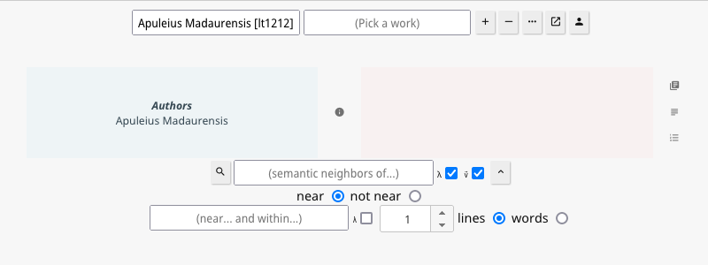
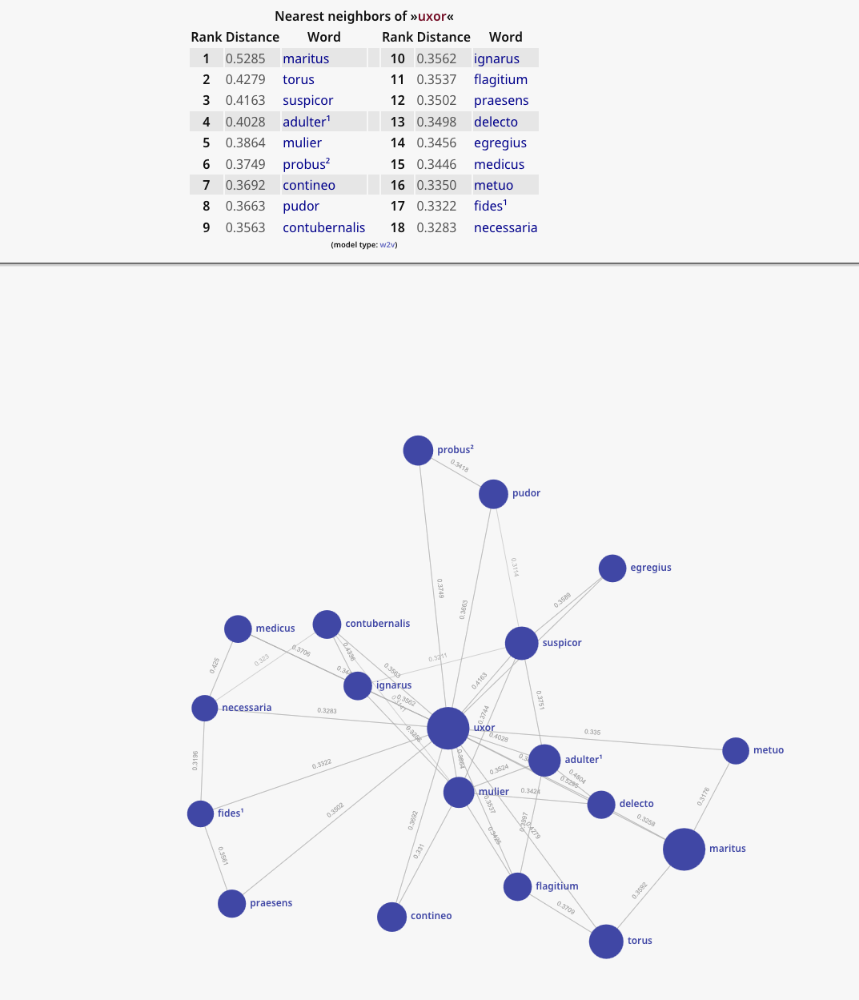

# Semantic Vector Nearest Neighbor Searches

If you request a lemmatized search (λ), you will be presented with the option to convert your search to a vectorized 
search (v⃗).



The server will check to see if there is a pre-built model for the current combination of options and texts selected.

If there is no model, one will be built and then saved for subsequent use. Building can be **slow**. Re-use is fast. 
Expect to wait a significant amount of time if you try to vectorize the entire corpus of Latin, for example. This will
take several minutes on a fast machine. All of Greek would take 10x as long. But the good news is that you only need to
build a model once. Also note that vectorization can be memory intensive. 



There is currently no browser-facing interface that allows for the customization of the rules used to build these 
models. Instead users will need to manually edit configuration files. Nevertheless, most people will feel little to
no need to edit these files. The defaults are sensible. Only the very keen and very curious will change them.

Vector models have three relevant configuration files stored inside of `~/.config/`. These are:
* `hgs-vector-conf-w2v.json`
* `hgs-vector-conf-glove.json`
* `hgs-vector-stops-greek.json`
* `hgs-vector-stops-latin.json`

If these are not present, they will be regenerated with default values. So, if you wish to revert an aspect of your 
set-up to its initial condition, you only need to delete one or more of these files.  

There is no way to drop an individual model. But you can reset the collection of stored models if you launch the server
with the `-rv` flag: `HipparchiaGoServer -rv`

Any edit to any of these configuration files will be detected when you next search. A new model will be built with those 
new settings.

The `stops` are lists of terms you wish to omit from the model. These should be common words that reveal little about the
underlying collection of words: "the", "this", "a", "where", "so" ... 

## Word2Vec

This is the default model maker. 

The default model building values follow. The values that one is most likely to adjust are `BatchSize`, `Dim`, `Iter`, 
and `Window`.

* Bigger `BatchSize` values should build faster, but the results might be less interesting. 
* Dimensionality (`Dim`) sets how many interrelationships to track. Too few or too many yield poor results. The "right" value is likely an illusion, but good choices are related to the size of the corpus you are searching.
* Iterations (`Iter`) are "training runs" on the data. It is possible to over-train. It is possible to under-train. 
* The `Window` setting adjusts the distance across which relationships will be tracked. If A and B are outside the window, no connection will be noted.

Tinkering with these four settings is not a bad idea. It would be a good idea to read up on `word2vec` before exploring
the other settings. 

The default `hgs-vector-conf-w2v.json`:

```
{
    "BatchSize": 1024,
    "Dim": 125,
    "DocInMemory": true,
    "Goroutines": [= runtime.NumCPU() on your machine],
    "Initlr": 0.025,
    "Iter": 15,
    "LogBatch": 100000,
    "MaxCount": -1,
    "MaxDepth": 150,
    "MinCount": 10,
    "MinLR": 0.0000025,
    "ModelType": "skipgram",
    "NegativeSampleSize": 5,
    "OptimizerType": "hs",
    "SubsampleThreshold": 0.001,
    "ToLower": false,
    "UpdateLRBatch": 100000,
    "Verbose": true,
    "Window": 8
  }
```

The underlying source code for the modeling can be found at https://github.com/ynqa/wego. There you can find a couple 
of "hidden" values one might adjust when setting `OptimizerType` and `ModelType`. The former can be either `ns` or `hs`.
The latter can be either `cbow` or `skipgram`. You will also see the default values that the authors of that package
distribute. Note that `defaultDim` is strikingly low at `10` and is only useful to show that code can generate a model,
not that it can generate an interesting model. Most tutorials talk about models with 100-300 dimensions. 

```
const (
	NegativeSampling    OptimizerType = "ns"
	HierarchicalSoftmax OptimizerType = "hs"
)

const (
	Cbow     ModelType = "cbow"
	SkipGram ModelType = "skipgram"
)

var (
	defaultBatchSize          = 10000
	defaultDim                = 10
	defaultDocInMemory        = false
	defaultGoroutines         = runtime.NumCPU()
	defaultInitlr             = 0.025
	defaultIter               = 15
	defaultLogBatch           = 100000
	defaultMaxCount           = -1
	defaultMaxDepth           = 100
	defaultMinCount           = 5
	defaultMinLR              = defaultInitlr * 1.0e-4
	defaultModelType          = Cbow
	defaultNegativeSampleSize = 5
	defaultOptimizerType      = NegativeSampling
	defaultSubsampleThreshold = 1.0e-3
	defaultToLower            = false
	defaultUpdateLRBatch      = 100000
	defaultVerbose            = false
	defaultWindow             = 5
)

```

Individual model results do not repeat because `word2vec.Train()` in `pkg/model/word2vec/word2vec.go` has
`vec[i] = (rand.Float64() - 0.5) / float64(dim)` The call to `rand.Float64()` means that models with identical settings 
will differ. In fact, one often seems to be more interesting than the other. 

On models see also: https://link.springer.com/article/10.1007/s41019-019-0096-6

## LexVec

This is not the default model maker. It must be requested from the command line via the `-md lexvec` flag, or it
can be set in `hgs-prolix-conf.json`.

The results are of comparable quality to those offered by Word2Vec. `RelationType` has four options: `ppmi`, 
`pmi`, `co`, and `logco`. 

The default `hgs-vector-conf-glove.json`:

```
{
    "BatchSize": 1024,
    "Dim": 125,
    "DocInMemory": true,
    "Goroutines": [= runtime.NumCPU() on your machine],
    "Initlr": 0.025,
    "Iter": 15,
    "LogBatch": 100000,
    "MaxCount": -1,
    "MinCount": 10,
    "MinLR": 0.0000025,
    "NegativeSampleSize": 5,
    "RelationType": "ppmi",
    "Smooth": 0.75,
    "SubsampleThreshold": 0.001,
    "ToLower": false,
    "UpdateLRBatch": 100000,
    "Verbose": true,
    "Window": 8
  }
```

## GloVe

This is not the default model maker. It must be requested from the command line via the `-md glove` flag, or it 
can be set in `hgs-prolix-conf.json`

The results are currently not as satisfying as those obtained from Word2Vec. `CountType` has two options, `inc` 
and `prox`. But the model will panic if you pick `prox`. `SolverType` can be either `sdg` or `adagrad`. Either is
safe to use. 

The default `hgs-vector-conf-glove.json`:

```
{
    "Alpha": 0.40,
    "BatchSize": 6000,
    "CountType": "inc",
    "Dim": 125,
    "DocInMemory": true,
    "Goroutines": [= runtime.NumCPU() on your machine],
    "Initlr": 0.025,
    "Iter": 15,
    "LogBatch": 100000,
    "MaxCount": -1,
    "MinCount": 10,
    "SolverType": "adagrad",
    "SubsampleThreshold": 0.001,
    "ToLower": false,
    "Verbose": true,
    "Window": 8,
    "Xmax": 100
  }
  
```

See also https://nlp.stanford.edu/projects/glove/.