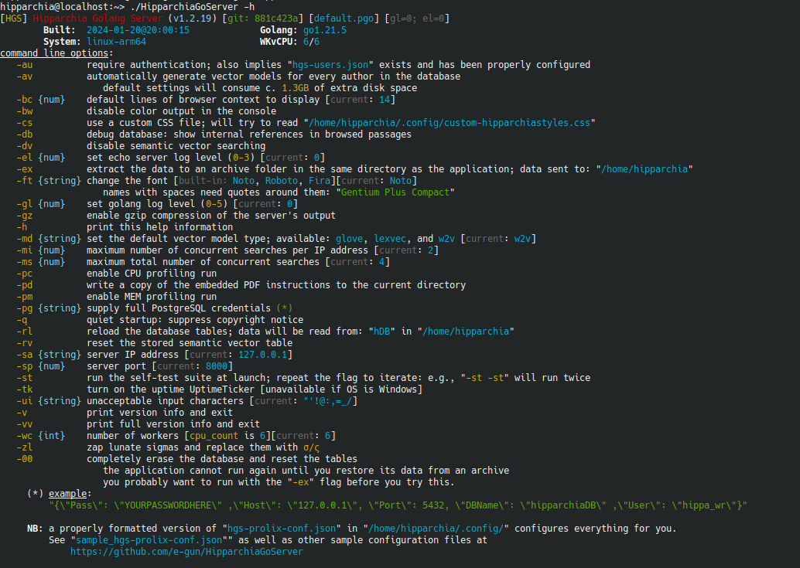
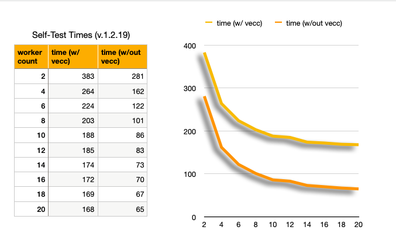
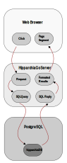

# HipparchiaGoServer FYI

## CLI



## self-test

self-test without vectors is now `HipparchiaGoServer -st -dv`

``` 
[HGS] Hipparchia Golang Server (v1.2.16) [git: 64974732] [default.pgo] [gl=0; el=0]
	Built:	2023-11-03@20:35:01		Golang:	go1.21.3
	System:	darwin-arm64			WKvCPU:	20/20
[HGS] initialization took 0.489s
[HGS] to stop the server press Control-C or close this window
[HGS] Running Selftest 1 of 1
[HGS-SELFTEST] entering selftestsuite mode (4 segments)
[HGS-SELFTEST] [I] 6 search tests
⇨ http server started on 127.0.0.1:8000
[HGS-SELFTEST] [A1: 0.280s][Δ: 0.280s] single word in corpus: 'vervex'
[HGS-SELFTEST] [A2: 1.525s][Δ: 1.245s] phrase in corpus: 'plato omnem'
[HGS-SELFTEST] [A3: 3.135s][Δ: 1.610s] phrase near phrase: 'καὶ δὴ καὶ' near 'εἴ που καὶ'
[HGS-SELFTEST] [B1: 4.623s][Δ: 1.488s] lemma in corpus: 'φθορώδηϲ'
[HGS-SELFTEST] [B2: 6.068s][Δ: 1.445s] lemma near phrase: 'γαῖα' near 'ἐϲχάτη χθονόϲ'
[HGS-SELFTEST] [B3: 29.022s][Δ: 22.954s] lemma near lemma in corpus: 'πόλιϲ' near 'ὁπλίζω
[HGS-SELFTEST] [II] 3 text, index, and vocab maker tests
[HGS-SELFTEST] [C1: 29.221s][Δ: 0.199s] build a text for 35000 arbitrary lines
[HGS-SELFTEST] [C2: 33.425s][Δ: 4.204s] build an index to 35000 arbitrary lines
[HGS-SELFTEST] [C3: 35.637s][Δ: 2.212s] build vocabulary list for 35000 arbitrary lines
[HGS-SELFTEST] [III] 4 browsing and lexical tests
[HGS-SELFTEST] [D1: 37.761s][Δ: 2.123s] browse 50 passages
[HGS-SELFTEST] [D2: 44.571s][Δ: 6.810s] look up 48 specific words
[HGS-SELFTEST] [D3: 61.236s][Δ: 16.666s] look up 18 word substrings
[HGS-SELFTEST] [D4: 75.117s][Δ: 13.880s] reverse lookup for 6 word substrings
[HGS-SELFTEST] [IV] nearest neighbor vectorization tests
[HGS-SELFTEST] [E1: 96.957s][Δ: 21.840s] semantic vector model test: w2v - 1 author(s) with 4 text preparation modes per author
[HGS-SELFTEST] [E2: 119.770s][Δ: 22.813s] semantic vector model test: lexvec - 1 author(s) with 4 text preparation modes per author
[HGS-SELFTEST] [E3: 157.027s][Δ: 37.257s] semantic vector model test: glove - 1 author(s) with 4 text preparation modes per author
[HGS-SELFTEST] [V] lda vectorization tests
[HGS-SELFTEST] [F: 177.714s][Δ: 20.686s] lda vector model test - 1 author(s) with 4 text preparation modes per author

```

self-test with vectors can be deceptive because `-wc` flag will not override config json.

### some vectorless selftest times

* 91s on 8 cores of apple silicon (m1) virtualizing rocky linux
* 111s on 6 cores of apple silicon (m1) virtualizing rocky linux
* 113s on 6 cores of an intel 9900k running a virtualized ubuntu
* 147s on 6 cores of apple silicon (m1) virtualizing freebsd13 w/ zfs
* 101 on 6 cores of apple silicon (m1) virtualizing macos
* 232s on 6 cores of an intel 9900k running a virtualized windows 10
* 349s on a mac mini 2018
* 483s on 6 cores of apple silicon (m1) virtualizing windows 11 arm
* 1144s (ouch) on a 2017 MacBook w/ 1.3GHz Core i5

### self-test: cpu-constrained vs i/o constrained



## profiling

`HipparchiaGoServer -st` called to generate
* `default.pgo`
* `MEMProfile.pdf`
* `CPUProfile.pdf`

## memory use during self-test

``` 
[HGS] Hipparchia Golang Server (v1.2.18-pre) [git: ff28002d] [default.pgo] [gl=4; el=0]
	Built:	2024-01-04@17:29:21		Golang:	go1.21.5
	System:	darwin-arm64			WKvCPU:	20/20
[HGS] Number of stored vector models: 9
[HGS] [A1: 0.164s][Δ: 0.164s] 7461 works built: map[string]DbWork
[HGS] [A2: 0.171s][Δ: 0.007s] 2185 authors built: map[string]DbAuthor
[HGS] [A3: 0.173s][Δ: 0.002s] corpus maps built
[HGS] [B1: 0.217s][Δ: 0.217s] unnested lemma map built (158817 items)
[HGS] [B2: 0.276s][Δ: 0.059s] nested lemma map built
[HGS] main() post-initialization current heap: 94M
[HGS] initialization took 0.277s
[HGS] to stop the server press Control-C or close this window
[HGS] Running Selftest 1 of 1
[HGS-SELFTEST] entering selftestsuite mode (4 segments)
[HGS-SELFTEST] [I] 6 search tests
⇨ http server started on 127.0.0.1:8000
[HGS] RtSearch() current heap: 87M
[HGS-SELFTEST] [A1: 0.767s][Δ: 0.767s] single word in corpus: 'vervex'
[HGS] RtSearch() current heap: 102M
[HGS-SELFTEST] [A2: 1.873s][Δ: 1.105s] phrase in corpus: 'plato omnem'
[HGS] [Δ: 1.789s]  WithinXLinesSearch(): 2307 initial hits
[HGS] [Δ: 0.004s]  SSBuildQueries() rerun
[HGS] [Δ: 0.045s]  WithinXLinesSearch(): 3 subsequent hits
[HGS] RtSearch() current heap: 107M
[HGS-SELFTEST] [A3: 3.746s][Δ: 1.873s] phrase near phrase: 'καὶ δὴ καὶ' near 'εἴ που καὶ'
[HGS] RtSearch() current heap: 119M
[HGS-SELFTEST] [B1: 4.807s][Δ: 1.061s] lemma in corpus: 'φθορώδηϲ'
[HGS] SwapPhraseAndLemma() was called: lemmatized 'γαῖα' swapped with 'ἐϲχάτη χθονόϲ'
[HGS] [Δ: 1.542s]  WithinXLinesSearch(): 11 initial hits
[HGS] [Δ: 0.002s]  SSBuildQueries() rerun
[HGS] [Δ: 0.005s]  WithinXLinesSearch(): 4 subsequent hits
[HGS] RtSearch() current heap: 136M
[HGS-SELFTEST] [B2: 6.398s][Δ: 1.591s] lemma near phrase: 'γαῖα' near 'ἐϲχάτη χθονόϲ'
[HGS] PickFastestLemma() is NOT swapping πόλιϲ for ὁπλίζω: possible hits 125274 vs 2547; known forms 50 vs 191
[HGS] [Δ: 6.794s]  WithinXLinesSearch(): 99350 initial hits
[HGS] [Δ: 0.179s]  SSBuildQueries() rerun
[HGS] [Δ: 14.837s]  WithinXLinesSearch(): 101 subsequent hits
[HGS] RtSearch() current heap: 174M
[HGS-SELFTEST] [B3: 28.665s][Δ: 22.266s] lemma near lemma in corpus: 'πόλιϲ' near 'ὁπλίζω
[HGS-SELFTEST] [II] 3 text, index, and vocab maker tests
[HGS] RtTextMaker() current heap: 240M
[HGS-SELFTEST] [C1: 28.867s][Δ: 0.202s] build a text for 35000 arbitrary lines
[HGS] arraytogetrequiredmorphobjects() will search among 164670 words
[HGS] RtIndexMaker() current heap: 393M
[HGS-SELFTEST] [C2: 32.985s][Δ: 4.118s] build an index to 35000 arbitrary lines
[HGS] arraytogetrequiredmorphobjects() will search among 165384 words
[HGS] RtVocabMaker() current heap: 429M
[HGS-SELFTEST] [C3: 35.539s][Δ: 2.554s] build vocabulary list for 35000 arbitrary lines
[HGS-SELFTEST] [III] 4 browsing and lexical tests
[HGS] RtBrowseLine() current heap: 450M
...
[HGS] RtBrowseLine() current heap: 492M
[HGS-SELFTEST] [D1: 35.734s][Δ: 0.195s] browse 50 passages
[HGS] RtLexFindByForm() current heap: 492M
... 
[HGS] RtLexFindByForm() current heap: 532M
[HGS-SELFTEST] [D2: 40.006s][Δ: 4.271s] look up 48 specific words
[HGS] RtLexLookup() current heap: 539M
...
[HGS] RtLexLookup() current heap: 152M
[HGS-SELFTEST] [D3: 55.451s][Δ: 15.445s] look up 18 word substrings
[HGS] RtLexReverse() current heap: 208M
...
```

## workflow



## code stats

```
% cloc --exclude-dir=z --not-match-f="^jq*" .
     146 text files.
     134 unique files.                                          
     178 files ignored.

github.com/AlDanial/cloc v 2.00  T=0.10 s (1299.2 files/s, 292629.2 lines/s)
-------------------------------------------------------------------------------
Language                     files          blank        comment           code
-------------------------------------------------------------------------------
Go                              81           3100           3627          14178
JavaScript                       8            311            193           1592
CSS                              1            349             89           1567
HTML                            12            160             18           1532
Markdown                        11            452              0           1182
XML                              4              0              0            450
Text                             5             90              0            412
SVG                              1              1              1            392
JSON                             9              0              0            386
Bourne Shell                     1             13              7             63
Python                           1              5              6              7
-------------------------------------------------------------------------------
SUM:                           134           4481           3941          21761
-------------------------------------------------------------------------------

```