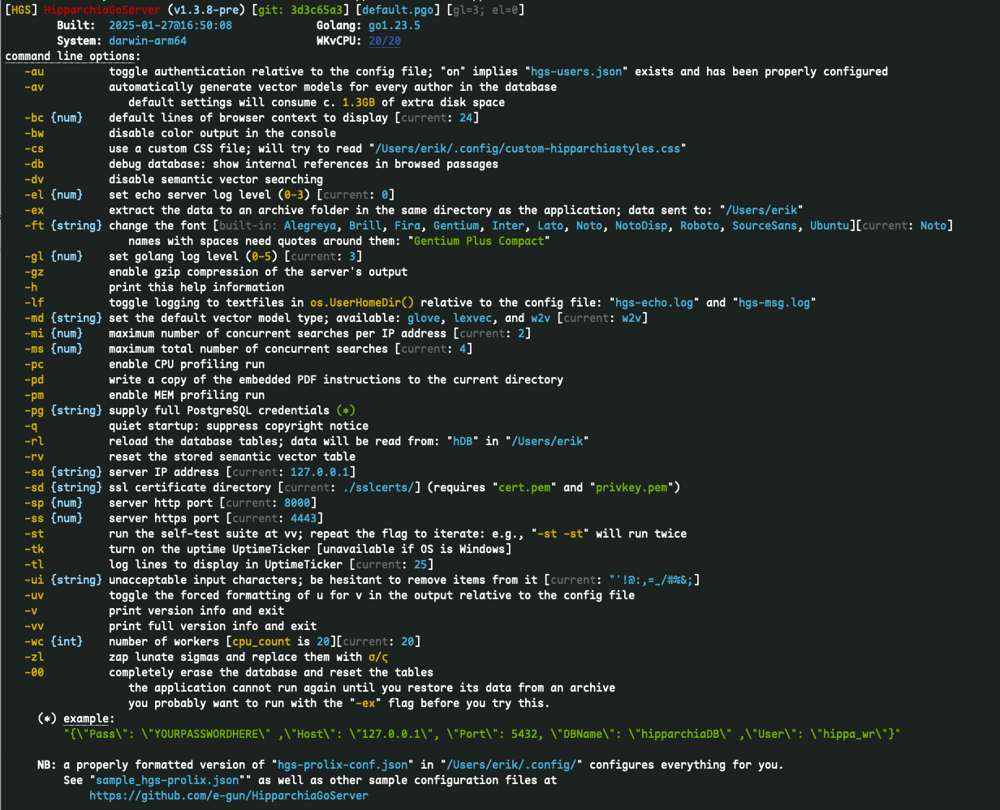
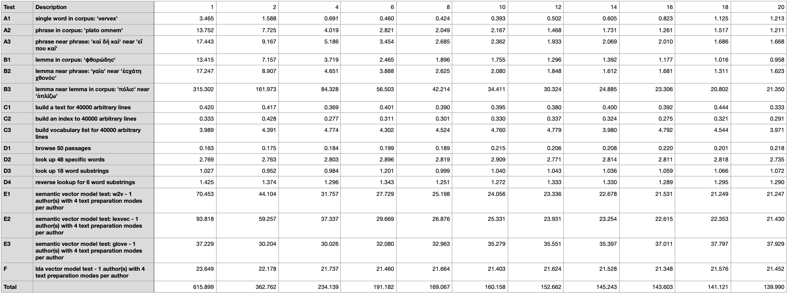
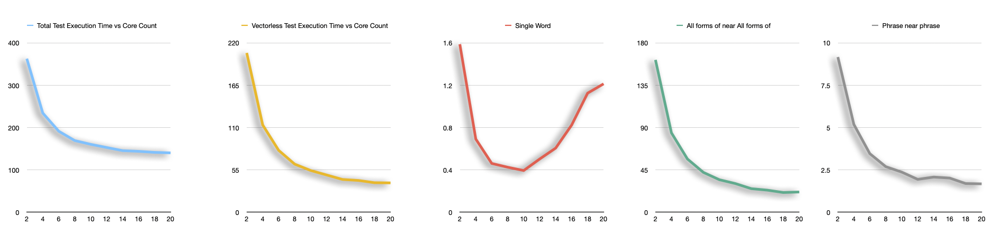
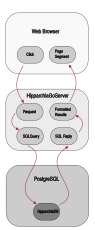

# HipparchiaGoServer FYI

## Frontpage size

`10 requests 1.46 MB / 1.47 MB transferred`

the fonts are most of the data; they have been subsetted (but `iosevka` is 756k of the above)

comparanda:

* `nytimes.com` is c. 7MB.
* `amazon.com` is c. 7MB.
* `instagram.com` is c. 8.75MB.
* `bing.com` is c. 9.5MB.

## CLI



## self-test

self-test without vectors is now `HipparchiaGoServer -st -dv`

``` 
e-gun/HipparchiaGoServer/ % ./HipparchiaGoServer -st -gl 3
[HGS] HipparchiaGoServer (v2.0.0-pre) [git: db012bd0] [default.pgo] [gl=3; el=0]
	Built:	2025-06-17@10:22:24		Golang:	go1.24.4
	System:	darwin-arm64			WKvCPU:	20/20
[HGS-DBI] Number of stored vector models: 12
[HGS] [A1: 0.078s][Δ: 0.078s] 7462 works built: map[string]DbWork
[HGS] [A2: 0.087s][Δ: 0.009s] 2186 authors built: map[string]DbAuthor
[HGS] [A3: 0.090s][Δ: 0.002s] corpus maps built
[HGS] [B1: 0.154s][Δ: 0.154s] unnested lemma map built (158966 items)
[HGS] [B2: 0.203s][Δ: 0.049s] nested lemma map built
[HGS] initialization took 0.292s
[HGS] to stop the server press Control-C or close this window
[HGS-WEB] (tls unavailable)
[HGS-SELFTEST] Running Selftest 1 of 1
[HGS-SELFTEST] entering selftestsuite mode (4 segments)
[HGS-SELFTEST] [I] 6 search tests
⇨ http server started on 127.0.0.1:8001
[HGS-SELFTEST] [A1: 1.250s][Δ: 1.250s] single word in corpus: 'vervex'
[HGS-SELFTEST] [A2: 2.667s][Δ: 1.417s] phrase in corpus: 'plato omnem'
[HGS-SELFTEST] [A3: 4.313s][Δ: 1.645s] phrase near phrase: 'καὶ δὴ καὶ' near 'εἴ που καὶ'
[HGS-SELFTEST] [B1: 5.680s][Δ: 1.367s] lemma in corpus: 'φθορώδηϲ'
[HGS-SELFTEST] [B2: 7.377s][Δ: 1.697s] lemma near phrase: 'γαῖα' near 'ἐϲχάτη χθονόϲ'
[HGS-SELFTEST] [B3: 27.858s][Δ: 20.481s] lemma near lemma in corpus: 'πόλιϲ' near 'ὁπλίζω'
[HGS-SELFTEST] [II] 3 text, index, and vocab maker tests
[HGS-SELFTEST] [C1: 28.266s][Δ: 0.409s] build a text for 40000 arbitrary lines
[HGS-SELFTEST] [C2: 28.634s][Δ: 0.368s] build an index to 40000 arbitrary lines
[HGS-SELFTEST] [C3: 32.720s][Δ: 4.087s] build vocabulary list for 40000 arbitrary lines
[HGS-SELFTEST] [III] 4 browsing and lexical tests
[HGS-WEB] could not find a work for tlg0021w001
[HGS-WEB] could not find a work for tlg0025w001
[HGS-SELFTEST] [D1: 32.913s][Δ: 0.193s] browse 50 passages
[HGS-SELFTEST] [D2: 35.602s][Δ: 2.689s] look up 48 specific words
[HGS-SELFTEST] [D3: 36.662s][Δ: 1.059s] look up 18 word substrings
[HGS-SELFTEST] [D4: 37.864s][Δ: 1.203s] reverse lookup for 6 word substrings
[HGS-DBI] VectorDBReset() dropped semantic_vectors_nn
[HGS-SELFTEST] [IV] nearest neighbor vectorization tests
[HGS-DBI] vectordbinitnn(): success
[HGS-SELFTEST] [E1: 58.820s][Δ: 20.955s] semantic vector model test: w2v - 1 author(s) with 4 text preparation modes per author
[HGS-SELFTEST] [E2: 80.535s][Δ: 21.715s] semantic vector model test: lexvec - 1 author(s) with 4 text preparation modes per author
[HGS-SELFTEST] [E3: 118.893s][Δ: 38.358s] semantic vector model test: glove - 1 author(s) with 4 text preparation modes per author
[HGS-SELFTEST] [V] lda vectorization tests
[HGS-SELFTEST] [F: 140.244s][Δ: 21.351s] lda vector model test - 1 author(s) with 4 text preparation modes per author
[HGS-SELFTEST] exiting selftestsuite mode

```

### some vectorless selftest times

* 91s on 8 cores of apple silicon (m1) virtualizing rocky linux
* 111s on 6 cores of apple silicon (m1) virtualizing rocky linux
* 113s on 6 cores of an intel 9900k running a virtualized ubuntu
* 147s on 6 cores of apple silicon (m1) virtualizing freebsd13 w/ zfs
* 101 on 6 cores of apple silicon (m1) virtualizing macos
* 232s on 6 cores of an intel 9900k running a virtualized windows 10
* 349s on a mac mini 2018
* 483s on 6 cores of apple silicon (m1) virtualizing windows 11 arm
* 1144s (ouch) on a 2017 MacBook w/ 1.3GHz Core i5

### self-test: how many cores is enough?

Some individual tests split well over multiple workers. Some do not. And even then, more cores helps until it does not.

Note that 20 cores can be slower than 12 in some (fast-to-finish) tests. And more cores barely matters after 6
for vector tests. The lemmata tests yield the major differences. Diminishing returns start to hit hard  around 7 cores. Real gains stop around 14 cores in every case. 

The default setting is `use all cores`, but many people can safely dial this back. 





## profiling

`HipparchiaGoServer -st` called to generate
* `default.pgo`
* `MEMProfile.pdf`
* `CPUProfile.pdf`

## memory use during self-test

``` 
% /Users/erik/Applications/net/HipparchiaGoServer -st -wc 20 -gl 4
[HGS] Hipparchia Golang Server (v1.3.1-pre) [git: ed35669c] [default.pgo] [gl=4; el=0]
	Built:	2024-03-22@14:20:00		Golang:	go1.22.1
	System:	darwin-arm64			WKvCPU:	20/20
[HGS-VEC] Number of stored vector models: 12
[HGS-MPS] MapNewWorkCorpus() added 6625 works from 'gr'
[HGS-MPS] MapNewWorkCorpus() added 836 works from 'lt'
[HGS] [A1: 0.152s][Δ: 0.152s] 7461 works built: map[string]DbWork
[HGS-MPS] MapNewAuthorCorpus() added 1823 authors from 'gr'
[HGS-MPS] MapNewAuthorCorpus() added 362 authors from 'lt'
[HGS] [A2: 0.160s][Δ: 0.008s] 2185 authors built: map[string]DbAuthor
[HGS] [A3: 0.162s][Δ: 0.002s] corpus maps built
[HGS] [B1: 0.210s][Δ: 0.210s] unnested lemma map built (158817 items)
[HGS] [B2: 0.269s][Δ: 0.059s] nested lemma map built
[HGS] main() post-initialization current heap: 80M
[HGS] initialization took 0.309s
[HGS] to stop the server press Control-C or close this window
[HGS-SELFTEST] Running Selftest 1 of 1
[HGS-SELFTEST] entering selftestsuite mode (4 segments)
[HGS-SELFTEST] [I] 6 search tests
⇨ http server started on 127.0.0.1:8000
[HGS-WEB] RtSearch() current heap: 92M
[HGS-SELFTEST] [A1: 0.700s][Δ: 0.700s] single word in corpus: 'vervex'
[HGS-WEB] RtSearch() current heap: 106M
[HGS-SELFTEST] [A2: 1.992s][Δ: 1.292s] phrase in corpus: 'plato omnem'
[HGS-SEA] [Δ: 1.337s]  WithinXLinesSearch(): 2307 initial hits
[HGS-SEA] [Δ: 0.004s]  SSBuildQueries() rerun
[HGS-SEA] [Δ: 0.033s]  WithinXLinesSearch(): 3 subsequent hits
[HGS-WEB] RtSearch() current heap: 103M
[HGS-SELFTEST] [A3: 3.391s][Δ: 1.400s] phrase near phrase: 'καὶ δὴ καὶ' near 'εἴ που καὶ'
[HGS-WEB] RtSearch() current heap: 115M
[HGS-SELFTEST] [B1: 4.457s][Δ: 1.066s] lemma in corpus: 'φθορώδηϲ'
[HGS-STR] SwapPhraseAndLemma() was called: lemmatized 'γαῖα' swapped with 'ἐϲχάτη χθονόϲ'
[HGS-SEA] [Δ: 1.584s]  WithinXLinesSearch(): 11 initial hits
[HGS-SEA] [Δ: 0.002s]  SSBuildQueries() rerun
[HGS-SEA] [Δ: 0.004s]  WithinXLinesSearch(): 4 subsequent hits
[HGS-WEB] RtSearch() current heap: 132M
[HGS-SELFTEST] [B2: 6.071s][Δ: 1.614s] lemma near phrase: 'γαῖα' near 'ἐϲχάτη χθονόϲ'
[HGS-SEA] PickFastestLemma() is NOT swapping πόλιϲ for ὁπλίζω: possible hits 125274 vs 2547; known forms 50 vs 191
[HGS-SEA] [Δ: 6.100s]  WithinXLinesSearch(): 99350 initial hits
[HGS-SEA] [Δ: 0.189s]  SSBuildQueries() rerun
[HGS-SEA] [Δ: 14.943s]  WithinXLinesSearch(): 101 subsequent hits
[HGS-WEB] RtSearch() current heap: 196M
[HGS-SELFTEST] [B3: 27.552s][Δ: 21.481s] lemma near lemma in corpus: 'πόλιϲ' near 'ὁπλίζω'
[HGS-SELFTEST] [II] 3 text, index, and vocab maker tests
[HGS-WEB] RtTextMaker() current heap: 338M
[HGS-SELFTEST] [C1: 27.757s][Δ: 0.205s] build a text for 35000 arbitrary lines
[HGS-WEB] RtIndexMaker() current heap: 302M
[HGS-SELFTEST] [C2: 28.961s][Δ: 1.204s] build an index to 35000 arbitrary lines
[HGS-DBI] ArrayToGetRequiredMorphObjects() will search among 153612 words
[HGS-WEB] RtVocabMaker() current heap: 432M
[HGS-SELFTEST] [C3: 31.379s][Δ: 2.418s] build vocabulary list for 35000 arbitrary lines
[HGS-SELFTEST] [III] 4 browsing and lexical tests
...
[HGS-WEB] RtBrowseLine() current heap: 221M
[HGS-SELFTEST] [D1: 31.557s][Δ: 0.178s] browse 50 passages
...
[HGS-WEB] RtLexFindByForm() current heap: 264M
[HGS-SELFTEST] [D2: 35.687s][Δ: 4.130s] look up 48 specific words
...
[HGS-WEB] RtLexLookup() current heap: 190M
[HGS-SELFTEST] [D3: 50.739s][Δ: 15.052s] look up 18 word substrings
...
[HGS-WEB] RtLexReverse() current heap: 285M
[HGS-SELFTEST] [D4: 62.603s][Δ: 11.864s] reverse lookup for 6 word substrings
...
```

## workflow



## code stats

```
% cloc --exclude-dir=z --not-match-f="^jq*" .
     207 text files.
     191 unique files.
    3743 files ignored.

github.com/AlDanial/cloc v 2.04  T=0.80 s (237.5 files/s, 44104.4 lines/s)
-------------------------------------------------------------------------------
Language                     files          blank        comment           code
-------------------------------------------------------------------------------
Go                             120           3688           4157          17502
CSS                             13            477            144           2013
HTML                            13            162             18           1589
JavaScript                       8            321            216           1587
Markdown                        10            447              0           1156
Text                             6            108              0            487
XML                              8              0              0            454
JSON                             8              0              0            416
SVG                              1              1              1            392
Bourne Shell                     3             25              7             89
Python                           1              5              6              7
-------------------------------------------------------------------------------
SUM:                           191           5234           4549          25692
-------------------------------------------------------------------------------

```