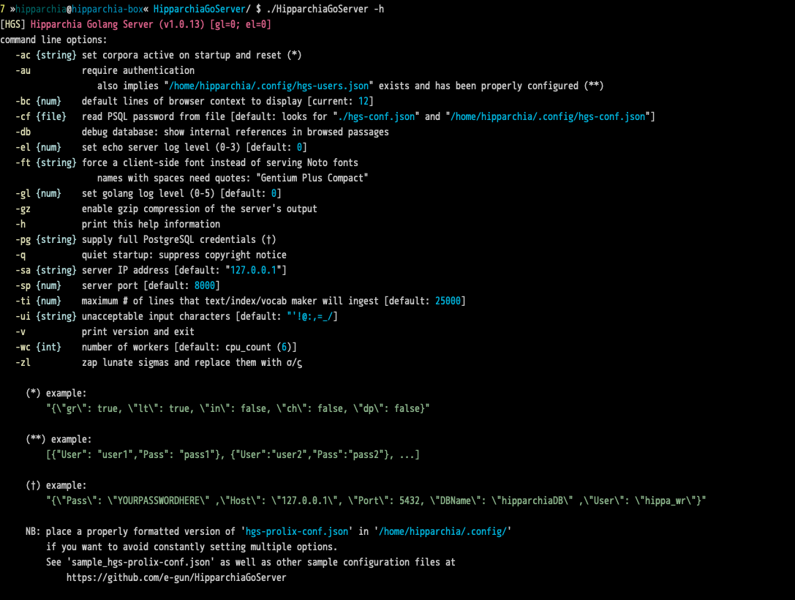
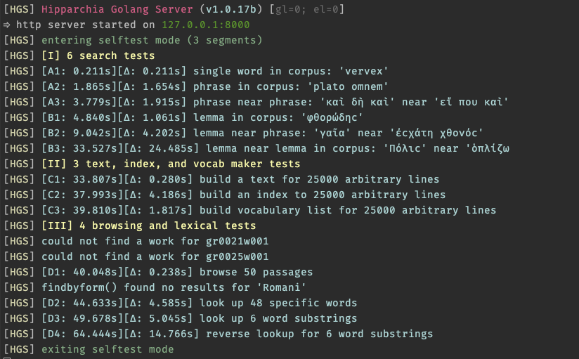
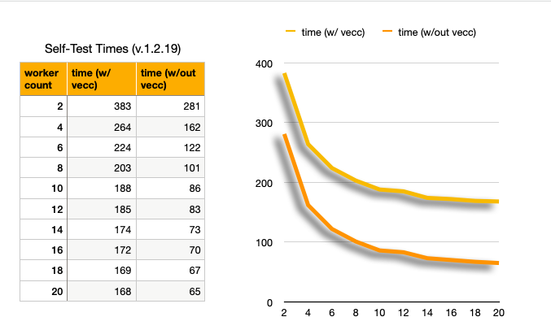
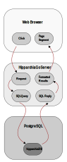

# FYI

## CLI



## self-test

### some selftest times

* 113s on 6 cores of an intel 9900k running a virtualized ubuntu
* 154s on 6 cores of apple silicon (m1) virtualizing macos
* 232s on 6 cores of an intel 9900k running a virtualized windows 10
* 349s on a mac mini 2018
* 483s on 6 cores of apple silicon (m1) virtualizing windows 11 arm
* 1144s (ouch) on a 2017 MacBook w/ 1.3GHz Core i5

### self-test: cpu-constrained vs  i/o constrained



## workflow



## code stats

```
% cloc *go

      34 text files.
      34 unique files.                              
       0 files ignored.

github.com/AlDanial/cloc v 1.96  T=0.03 s (1076.1 files/s, 414274.5 lines/s)
-------------------------------------------------------------------------------
Language                     files          blank        comment           code
-------------------------------------------------------------------------------
Go                              34           1976           1786           9327
-------------------------------------------------------------------------------
SUM:                            34           1976           1786           9327
-------------------------------------------------------------------------------

```