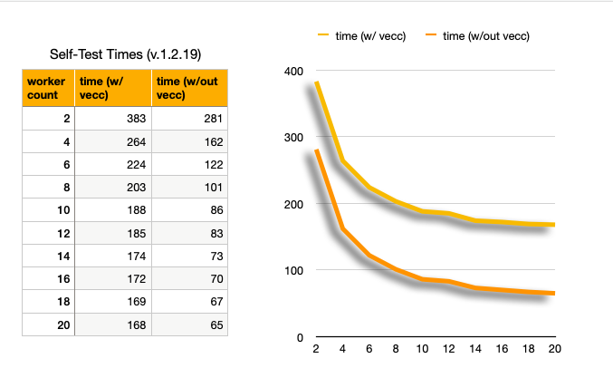

# HipparchiaGoServer FYI

## CLI


## self-test

self-test without vectors is now `HipparchiaGoServer -st -dv`

``` 
HipparchiaGoServer -dv -st -st -st
[HGS] Hipparchia Golang Server (v1.2.11-pre) [git: 5ac0df41] [gl=0; el=0]
[HGS] Running Selftest 1 of 3
⇨ http server started on 127.0.0.1:8000
	Built:	2023-08-15@21:19:49
	Go:	go1.21.0
[HGS-SELFTEST] entering selftest mode (3 segments)
[HGS-SELFTEST] [I] 6 search tests
[HGS-SELFTEST] [A1: 0.271s][Δ: 0.271s] single word in corpus: 'vervex'
[HGS-SELFTEST] [A2: 1.688s][Δ: 1.417s] phrase in corpus: 'plato omnem'
[HGS-SELFTEST] [A3: 3.563s][Δ: 1.875s] phrase near phrase: 'καὶ δὴ καὶ' near 'εἴ που καὶ'
[HGS-SELFTEST] [B1: 5.004s][Δ: 1.441s] lemma in corpus: 'φθορώδηϲ'
[HGS-SELFTEST] [B2: 10.299s][Δ: 5.295s] lemma near phrase: 'γαῖα' near 'ἐϲχάτη χθονόϲ'
[HGS] lemmaintoregexslice() could not find 'Πόλιϲ'
[HGS-SELFTEST] [B3: 10.492s][Δ: 0.193s] lemma near lemma in corpus: 'Πόλιϲ' near 'ὁπλίζω
[HGS-SELFTEST] [II] 3 text, index, and vocab maker tests
[HGS-SELFTEST] [C1: 10.756s][Δ: 0.264s] build a text for 35000 arbitrary lines
[HGS-SELFTEST] [C2: 17.533s][Δ: 6.777s] build an index to 35000 arbitrary lines
[HGS-SELFTEST] [C3: 20.864s][Δ: 3.331s] build vocabulary list for 35000 arbitrary lines
[HGS-SELFTEST] [III] 4 browsing and lexical tests
[HGS] could not find a work for gr0021w001
[HGS] could not find a work for gr0025w001
[HGS-SELFTEST] [D1: 23.293s][Δ: 2.429s] browse 50 passages
[HGS] findbyform() found no results for 'Romani'
[HGS-SELFTEST] [D2: 30.453s][Δ: 7.160s] look up 48 specific words
[HGS-SELFTEST] [D3: 36.271s][Δ: 5.818s] look up 6 word substrings
[HGS-SELFTEST] [D4: 53.002s][Δ: 16.732s] reverse lookup for 6 word substrings
...
```

self-test with vectors can be deceptive because `-wc` flag will not override config json.

20 M1 cores
```
[HGS] Hipparchia Golang Server (v1.2.4-pre) [git: 3104b990] [gl=0; el=0]
[HGS] Running Selftest 1 of 2
	Built:	2023-04-07@20:12:58
	Go:	go1.20.3
⇨ http server started on 127.0.0.1:8000
...
[HGS] [IV] vectorization tests
[HGS] vectordbreset() dropped semantic_vectors
[HGS] vectordbinit(): success
[HGS] [E1: 97.276s][Δ: 26.007s] vector model test: w2v (2 authors with 4 text preparation modes each)
[HGS] [E2: 123.754s][Δ: 26.478s] vector model test: lexvec (2 authors with 4 text preparation modes each)
[HGS] [E3: 161.489s][Δ: 37.735s] vector model test: glove (2 authors with 4 text preparation modes each)

```
6 M1 cores + virtualization

```
[HGS] [IV] vectorization tests
[HGS] vectordbreset() dropped semantic_vectors
[HGS] vectordbinit(): success
[HGS] [E1: 198.268s][Δ: 43.153s] vector model test: w2v (2 authors with 4 text preparation modes each)
[HGS] [E2: 245.816s][Δ: 47.548s] vector model test: lexvec (2 authors with 4 text preparation modes each)
[HGS] [E3: 302.168s][Δ: 56.351s] vector model test: glove (2 authors with 4 text preparation modes each)
```

6 intel 9900k cores 
```
[HGS] [IV] vectorization tests
[HGS] vectordbreset() dropped semantic_vectors
[HGS] vectordbinit(): success
[HGS] [E1: 157.453s][Δ: 41.629s] vector model test: w2v (2 authors with 4 text preparation modes each)
[HGS] [E2: 213.944s][Δ: 56.491s] vector model test: lexvec (2 authors with 4 text preparation modes each)
[HGS] [E3: 247.067s][Δ: 33.124s] vector model test: glove (2 authors with 4 text preparation modes each)
```


### some vectorless selftest times

* 91s on 8 cores of apple silicon (m1) virtualizing rocky linux
* 111s on 6 cores of apple silicon (m1) virtualizing rocky linux
* 113s on 6 cores of an intel 9900k running a virtualized ubuntu
* 147s on 6 cores of apple silicon (m1) virtualizing freebsd13 w/ zfs
* 154s on 6 cores of apple silicon (m1) virtualizing macos
* 232s on 6 cores of an intel 9900k running a virtualized windows 10
* 349s on a mac mini 2018
* 483s on 6 cores of apple silicon (m1) virtualizing windows 11 arm
* 1144s (ouch) on a 2017 MacBook w/ 1.3GHz Core i5

### self-test: cpu-constrained vs i/o constrained



## profiling

`HipparchiaGoServer -st -st -st` called to generate
* `default.pgo`
* `MEMProfile.pdf`
* `CPUProfile.pdf` 

## memory use during self-test

``` 
[HGS] Hipparchia Golang Server (v1.1.6-pre) [git: 3cc8a3df] [gl=4; el=0]
[HGS] [B1: 0.198s][Δ: 0.198s] unnested lemma map built (152382 items)
[HGS] [A1: 0.264s][Δ: 0.264s] 236835 works built: map[string]DbWork
[HGS] [B2: 0.273s][Δ: 0.075s] nested lemma map built
[HGS] [A2: 0.302s][Δ: 0.037s] 3455 authors built: map[string]DbAuthor
[HGS] [A3: 0.374s][Δ: 0.073s] corpus maps built
[HGS] main() post-initialization runtime.GC() 239M --> 206M
[HGS] initialization took 0.395s before reaching StartEchoServer()
[HGS] Running Selftest 1 of 1
⇨ http server started on 127.0.0.1:8000
	Built:	2023-03-07@12:33:40
	Go:	devel go1.21-84609d874e Mon Mar 6 23:46:08 2023 +0000
[HGS] entering selftest mode (3 segments)
[HGS] [I] 6 search tests
[HGS] RtSearch() runtime.GC() 217M --> 210M
[HGS] [A1: 0.308s][Δ: 0.308s] single word in corpus: 'vervex'
[HGS] RtSearch() runtime.GC() 224M --> 215M
[HGS] [A2: 1.598s][Δ: 1.290s] phrase in corpus: 'plato omnem'
[HGS] [Δ: 1.360s]  WithinXLinesSearch(): 2307 initial hits
[HGS] [Δ: 0.003s]  SSBuildQueries() rerun
[HGS] [Δ: 0.023s]  WithinXLinesSearch(): 3 subsequent hits
[HGS] RtSearch() runtime.GC() 261M --> 219M
[HGS] [A3: 3.105s][Δ: 1.507s] phrase near phrase: 'καὶ δὴ καὶ' near 'εἴ που καὶ'
[HGS] RtSearch() runtime.GC() 231M --> 222M
[HGS] [B1: 4.504s][Δ: 1.399s] lemma in corpus: 'φθορώδηϲ'
[HGS] [Δ: 3.800s]  WithinXLinesSearch(): 86256 initial hits
[HGS] [Δ: 0.084s]  SSBuildQueries() rerun
[HGS] [Δ: 0.263s]  WithinXLinesSearch(): 4 subsequent hits
[HGS] RtSearch() runtime.GC() 386M --> 232M
[HGS] [B2: 8.799s][Δ: 4.295s] lemma near phrase: 'γαῖα' near 'ἐϲχάτη χθονόϲ'
[HGS] [Δ: 7.254s]  WithinXLinesSearch(): 99300 initial hits
[HGS] [Δ: 0.164s]  SSBuildQueries() rerun
[HGS] [Δ: 16.444s]  WithinXLinesSearch(): 101 subsequent hits
[HGS] RtSearch() runtime.GC() 535M --> 267M
[HGS] [B3: 33.207s][Δ: 24.409s] lemma near lemma in corpus: 'Πόλιϲ' near 'ὁπλίζω
[HGS] [II] 3 text, index, and vocab maker tests
[HGS] [C1: 33.474s][Δ: 0.267s] build a text for 35000 arbitrary lines
[HGS] [C2: 40.796s][Δ: 7.322s] build an index to 35000 arbitrary lines
[HGS] [C3: 43.873s][Δ: 3.077s] build vocabulary list for 35000 arbitrary lines
[HGS] [III] 4 browsing and lexical tests
[HGS] could not find a work for gr0021w001
[HGS] could not find a work for gr0025w001
[HGS] [D1: 44.085s][Δ: 0.212s] browse 50 passages
[HGS] findbyform() found no results for 'Romani'
[HGS] [D2: 48.748s][Δ: 4.663s] look up 48 specific words
[HGS] RtLexLookup() runtime.GC() 805M --> 398M
[HGS] RtLexLookup() runtime.GC() 403M --> 394M
[HGS] RtLexLookup() runtime.GC() 401M --> 394M
[HGS] RtLexLookup() runtime.GC() 398M --> 395M
[HGS] RtLexLookup() runtime.GC() 415M --> 400M
[HGS] [D3: 54.151s][Δ: 5.403s] look up 6 word substrings
[HGS] RtLexLookup() runtime.GC() 411M --> 399M
[HGS] RtLexReverse() runtime.GC() 458M --> 406M
[HGS] RtLexReverse() runtime.GC() 464M --> 413M
[HGS] RtLexReverse() runtime.GC() 426M --> 408M
[HGS] RtLexReverse() runtime.GC() 487M --> 417M
[HGS] RtLexReverse() runtime.GC() 463M --> 419M
[HGS] [D4: 69.234s][Δ: 15.083s] reverse lookup for 6 word substrings
[HGS] exiting selftest mode
[HGS] RtLexReverse() runtime.GC() 452M --> 414M
```

## workflow


## code stats

```
% cloc *.go
      42 text files.
      42 unique files.                              
       0 files ignored.

github.com/AlDanial/cloc v 1.96  T=0.05 s (915.2 files/s, 397577.4 lines/s)
-------------------------------------------------------------------------------
Language                     files          blank        comment           code
-------------------------------------------------------------------------------
Go                              42           2674           2956          12616
-------------------------------------------------------------------------------
SUM:                            42           2674           2956          12616
-------------------------------------------------------------------------------

```