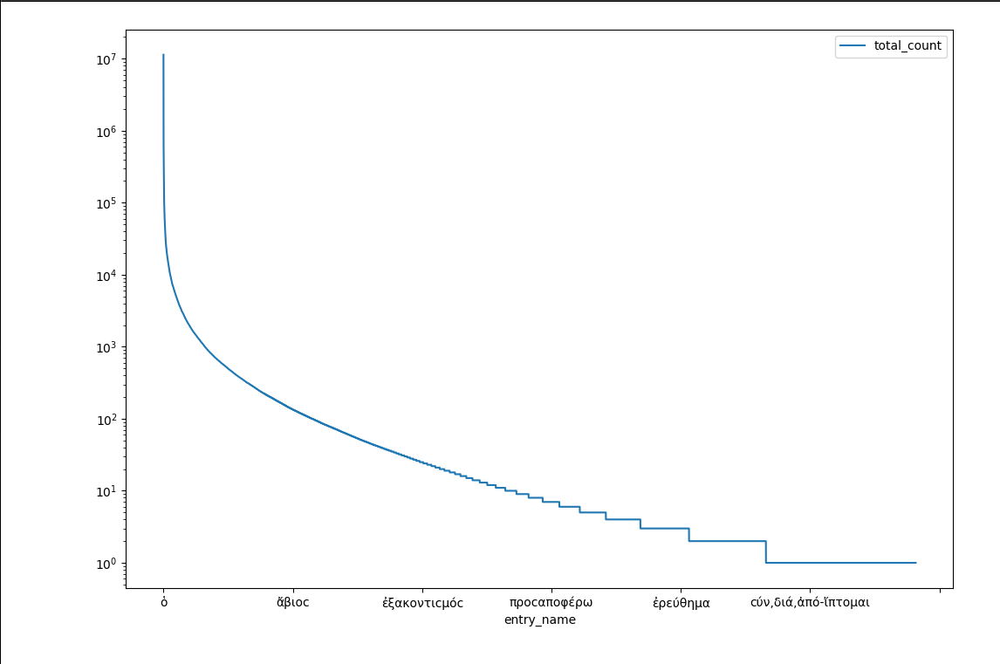
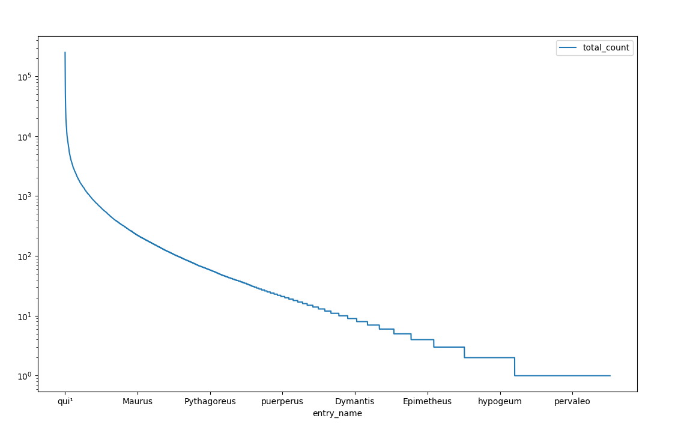

## Distribution of headwords

* Only a few words are used many times.
* Many words are used only a few times.

### Greek headwords (nb: only counting `gr` tables, not `in`, etc.)

* mean:	`942.2`
* median:	`8.0`

|                        | Count | Percentage|
|------------------------|-------|---|
| total headwords        | 116310  | 100|
| hapax legomena         | 25019 | 21.5|
| between 2 and 10       | 42209| 36.3|
| between 11 and 100     | 28861| 24.8|
| between 101 and 1000   | 14549| 12.5|
| between 1001 and 10000 | 4738| 4.1|
|  more than 10001       | 933| 0.8|




top 25:
```
hipparchiaDB=# SELECT entry_name,total_count from dictionary_headword_wordcounts where gr_count > 0 and entry_name ~ '[^a-z]' order by total_count desc limit 25;
 entry_name | total_count
------------+-------------
 ὁ          |    11354916
 καί        |     4506160
 τίϲ        |     2469211
 ἔδω        |     1972812
 δέ         |     1954138
 εἰμί       |     1869243
 δέω¹       |     1789427
 δεῖ        |     1759712
 δέομαι     |     1758513
 εἰϲ        |     1453295
 αὐτόϲ      |     1282454
 τιϲ        |     1056371
 οὗτοϲ      |      911403
 ἐν         |      896200
 γάροϲ      |      768587
 γάρον      |      768495
 γάρ        |      768149
 οὐ         |      716254
 μένω       |      663432
 μέν        |      633758
 τῷ         |      588780
 ἐγώ        |      566615
 ἡμόϲ       |      521449
 κατά       |      513070
 Ζεύϲ       |      513039
(25 rows)
```

### Latin headwords

* mean:	`292.2`
* median:	`11.0`

|                       | Count | Percentage|
|-----------------------|-------|---|
| total headwords       | 37594  | 100|
| hapax legomena        | 6908 | 18.3|
| between 2 and 10      | 12465| 33.1|
| between 11 and 100    | 10983| 29.2|
| between 101 and 1000  | 5693| 15.1|
| between 1001 and 10000 | 1423| 3.8|
| more than 10001       | 122| 0.3|




top 25:

``` 
hipparchiaDB=# SELECT entry_name,total_count from dictionary_headword_wordcounts where lt_count > 0 and entry_name ~ '[a-z]' order by total_count desc limit 25;
entry_name | total_count
------------+-------------
 qui¹       |      251744
 et         |      227326
 in         |      183796
 edo¹       |      159393
 is         |      132477
 sum¹       |      118283
 hic        |      100200
 non        |       96475
 ab         |       91730
 ut         |       76201
 Cos²       |       71333
 si         |       68895
 ad         |       68236
 cum        |       67427
 ex         |       65251
 a          |       65227
 eo¹        |       58129
 ego        |       53870
 quis¹      |       52619
 tu         |       51374
 Eos        |       50850
 dico²      |       48884
 ille       |       44214
 sed        |       44131
 de         |       42695
(25 rows)
```